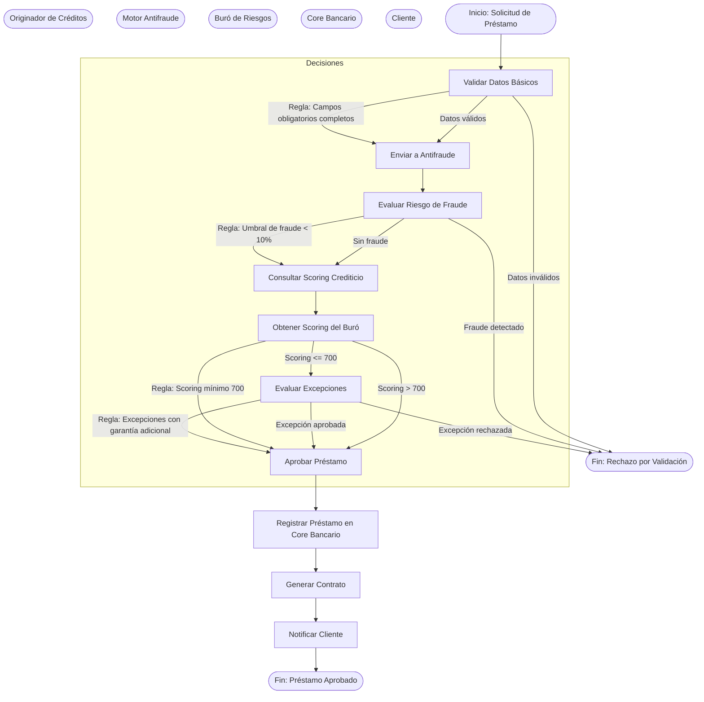
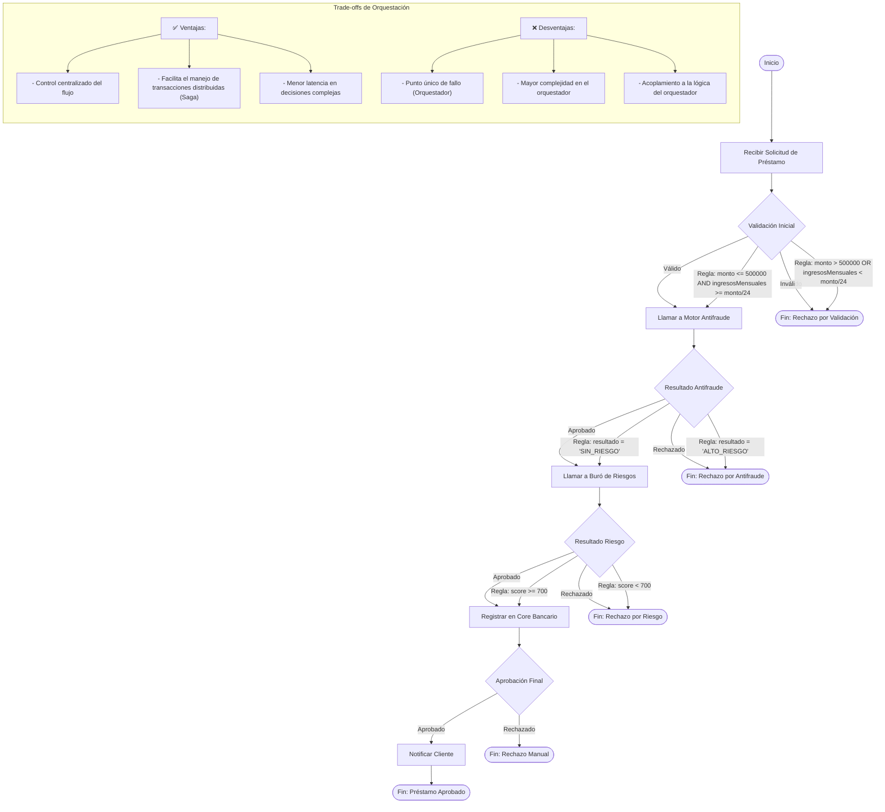
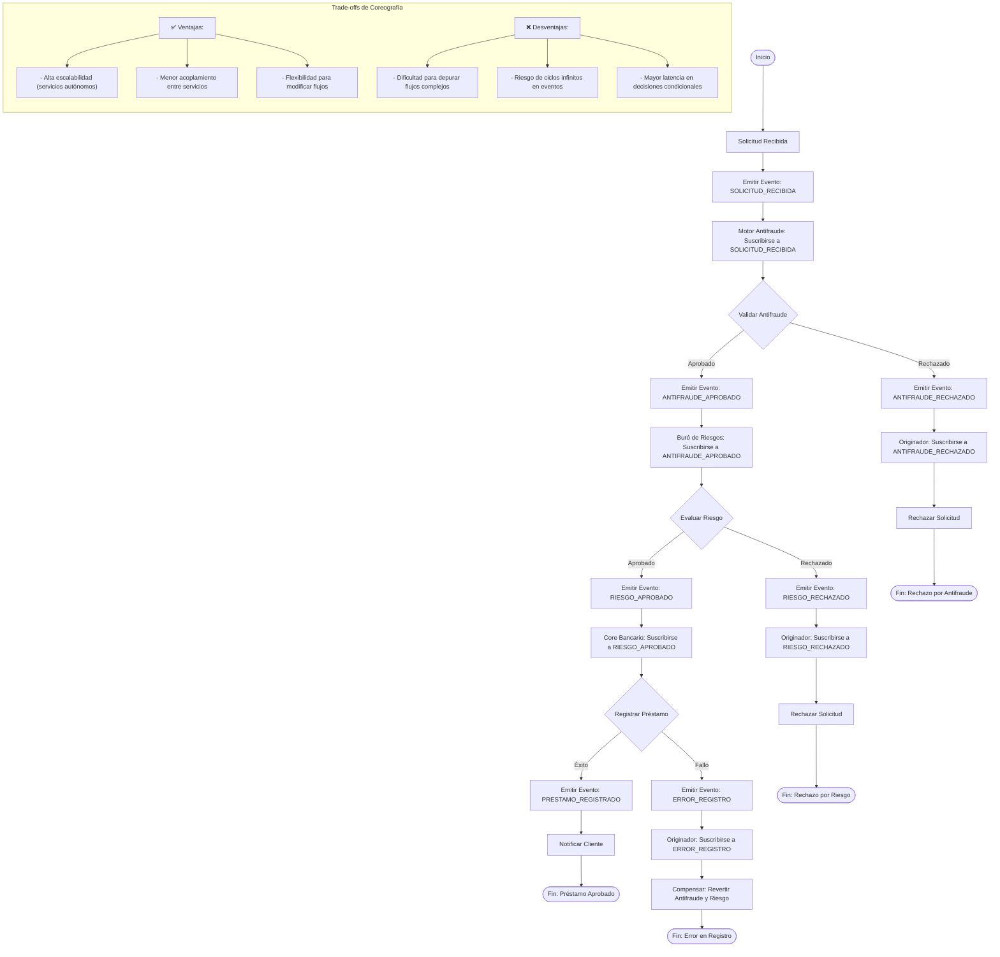
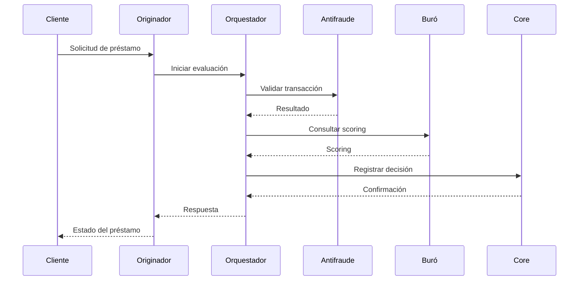
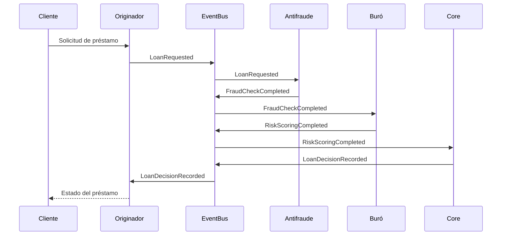
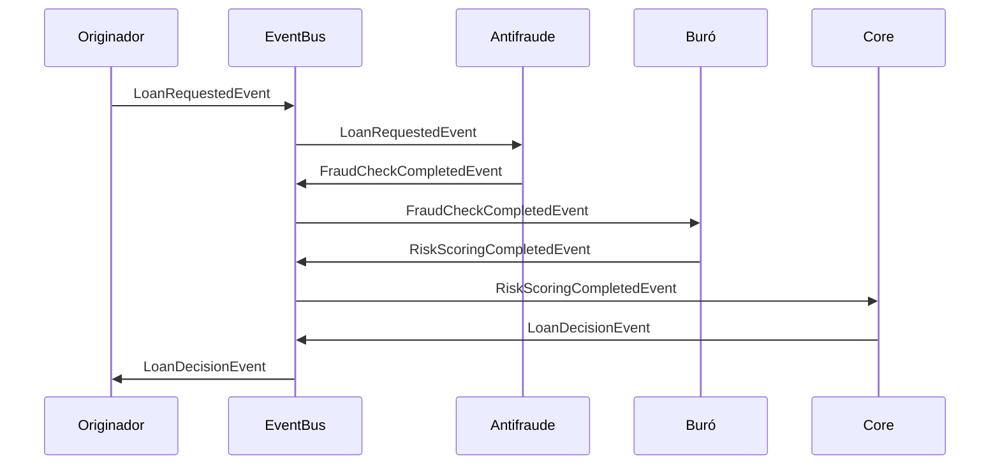
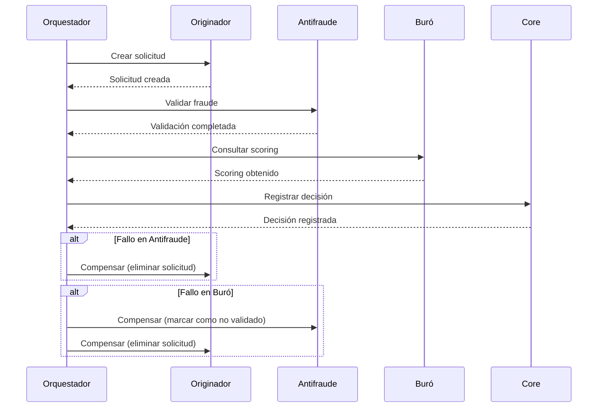

# Prompt para Mejorar el Codigo Base

Copia y pega el contenido del bloque de abajo en un asistente de IA (Claude, ChatGPT)
para obtener un ZIP con el proyecto completo y arrancable.

Si preferis trabajar en tu editor con un agente local (Claude Code, Cursor, Copilot), usa `AGENTS.md` en vez de este archivo: dice lo mismo pero para que escriba los archivos en disco.

## Las dos reglas que no se negocian

1. **Completa el boilerplate.** Todo lo que el proyecto necesita para compilar y arrancar: manifiesto de dependencias, punto de entrada, configuracion, capa de interfaz, y las capas del patron arquitectonico declarado. Eso es andamiaje y es tu trabajo.
2. **NO resuelvas el reto.** Los entregables de las fases son el trabajo de la persona. El hueco pedagogico se deja como esta: el proyecto arranca, pero lo que el reto pide implementar NO esta implementado.

Dicho de otra forma: si algo impide compilar, arreglalo. Si algo es logica de negocio incompleta, validaciones ausentes, un secreto hardcodeado o un patron mejorable, dejalo exactamente como esta — es lo que la persona tiene que encontrar.

## Superficie de practica — NO resuelvas

Estos archivos SON el ejercicio de la persona. No los implementes; deja stubs.

- `contratos/openapi.yaml` — El topic pide el contrato de API: openapi.yaml es el ejercicio.

## Como saber que terminaste

```bash
npx --yes @redocly/cli lint contratos/openapi.yaml
```

Ese comando corriendo sin errores es la definicion de "listo".

---

```
## Briefing del reto (autoridad)
Este bloque manda sobre los archivos adjuntos. El stack y el rol salen de AQUÍ, no de un topic genérico ni de markdown placeholder.

### Perfil
Chapter Integración, Especialidad Analista SOA, Tecnología SOA, Senior

### Brecha de conocimiento
¿Puede explicar las diferencias clave entre la orquestación y la coreografía en el contexto de arquitecturas de servicios, y proporcionar ejemplos prácticos de cuándo sería más apropiado utilizar cada enfoque? En entornos de microservicios y arquitecturas basadas en servicios, ¿cómo maneja y garantiza la consistencia en las transacciones distribuidas? ¿Puede describir estrategias específicas y herramientas que haya utilizado? ¿Cómo implementa una arquitectura orientada a eventos (EDA) en el contexto de microservicios y APIs? ¿Puede compartir casos de uso en los que EDA haya demostrado ser beneficioso?

### Misión / candidato
Candidato con experiencia como Analista SOA Senior, especializado en arquitecturas de integración.

### Reto
- Tema: Implementacion de la arquitectura SOA
- Seniority: senior-l3
- Tipo: mixed
- Título: Implementación de Arquitectura SOA
- Tiempo estimado: 10 horas

### Fases (trabajo del HUMANO — PROHIBIDO completarlas)
No implementes estos entregables. Dejalos como hueco pedagógico. El asistente solo materializa el proyecto arrancable para que el participante pueda trabajar.
- Fase 1: Evaluación de Orquestación vs Coreografía — objetivo: Elegir entre orquestación y coreografía para la coordinación de servicios en el sistema de gestión de préstamos hipotecarios. — entregable (NO resolver): Documento que detalla la elección entre orquestación y coreografía, con justificación y ejemplos prácticos.
- Fase 2: Gestión de Consistencia en Transacciones Distribuidas — objetivo: Implementar estrategias para manejar y garantizar la consistencia en las transacciones distribuidas del sistema. — entregable (NO resolver): Documento que describe las estrategias implementadas para manejar la consistencia en las transacciones distribuidas, incluyendo ejemplos de herramientas y patrones de diseño.
- Fase 3: Implementación de Arquitectura Orientada a Eventos (EDA) — objetivo: Diseñar y describir una arquitectura orientada a eventos (EDA) para la comunicación entre microservicios y APIs en el sistema. — entregable (NO resolver): Documento que describe la arquitectura EDA implementada, incluyendo casos de uso y beneficios.
- Fase 4: Revisión y Mejora Continua — objetivo: Revisar y mejorar continuamente la arquitectura implementada, identificando áreas de mejora y proponiendo soluciones. — entregable (NO resolver): Documento que describe las áreas de mejora identificadas y las soluciones propuestas para mejorar la arquitectura.

Eres un asistente experto en análisis, corrección y generación de archivos de cualquier tipo:
código fuente, documentación, hojas de cálculo, documentos Word, configuraciones, entre otros.
Voy a enviarte una cadena de texto que contiene uno o más archivos. Cada archivo está delimitado por un marcador con el siguiente formato:
// === ARCHIVO: ruta/del/archivo.extension ===
o también puede aparecer como:
## === ARCHIVO: ruta/del/archivo.extension ===
Lo que sigue al marcador puede ser:

El contenido real del archivo (código, texto, YAML, etc.)
Una descripción en lenguaje natural de lo que debe contener el archivo


TU TAREA
PASO 0 — ¿Esto es un proyecto o una carcasa?
Antes de extraer archivos, leé el Briefing (si está) y diagnosticá el adjunto.

Es CARCASA si ocurre CUALQUIERA de estas:
- No hay manifiesto de dependencias del stack del briefing (manifest.json de VTEX IO / package.json / pom.xml / build.gradle / requirements.txt / go.mod / *.tf / *.csproj, según corresponda)
- Hay un "binario" que en realidad es un comentario ("no puede ser mostrado como texto plano", placeholder .fig/.docx vacío)
- Los markdowns ya completan entregables de fases posteriores ("se implementó fade-in", lista de áreas ya resuelta)

Si es CARCASA:
- MATERIALIZÁ un proyecto que arranca en el stack del briefing (VTEX IO Store Framework, Angular, Terraform, pytest, Nest, etc.). Incluí manifiesto, punto de entrada y capa de interfaz reales.
- NO copies los markdowns de "solución" como si fueran el producto. Son ruido de generación.
- NO resuelvas las fases del briefing (están marcadas PROHIBIDO). Dejá el hueco pedagógico: el flujo existe, las microinteracciones/calidad/infra que el reto pide NO están hechas.
- Después seguí al PASO 5 (ZIP).

Si es un proyecto REAL (manifiesto + código que compila o arranca):
- Seguí PASO 1 en adelante. 🔴 compilación sí. 🟡 pedagógico no.

PASO 1 — Detección y extracción
Identifica todos los archivos presentes en la cadena. Para cada archivo extrae:

Su ruta completa (ej: src/main/java/com/pragma/Service.java)
Su contenido o descripción

PASO 2 — Clasificación por tipo
Clasifica cada archivo en una de estas categorías:
A) Código fuente (Java, Python, TypeScript, JavaScript, Kotlin, etc.)
B) Configuración / documentación (YAML, properties, Markdown, JSON, txt, etc.)
C) Excel (.xlsx, .xls, .csv)
D) Word (.docx, .doc)
E) Otro tipo de archivo binario o especial
PASO 3 — Clasificación de errores en código fuente

Objetivo prioritario: que el proyecto compile. No corrijas flujo de negocio ni lógica funcional.

Antes de modificar cualquier archivo de código fuente, clasifica cada problema encontrado en una de estas dos categorías:
🔴 ERROR DE COMPILACIÓN — corregir siempre
Son errores que impiden que el proyecto arranque, sin valor pedagógico:

Import faltante o incorrecto
Clase, método o variable referenciada que no existe en ningún archivo del proyecto
Error de sintaxis
Anotación con atributos inválidos
Dependencia ausente en pom.xml, package.json, etc.
Archivo referenciado que no existe y debe ser creado con implementación mínima

→ CORREGIR estos errores.
🟡 PROBLEMA FUNCIONAL O DE CALIDAD — preservar siempre
Son problemas que no impiden compilar. Pueden ser intencionales para el aprendizaje:

Clave secreta hardcodeada ("secret", "password123")
API deprecada que funciona pero tiene reemplazo moderno
Lógica de negocio incorrecta o incompleta
Código redundante o de baja legibilidad
Falta de validaciones en flujo de negocio
Patrones de diseño incorrectos pero funcionales
Concurrencia no segura
Configuración funcional pero no óptima

→ PRESERVAR tal cual. No corregir, no mejorar, no comentar.
PASO 4 — Procesamiento según tipo de archivo
Tipo A — Código fuente
Aplica únicamente las correcciones clasificadas como 🔴 ERROR DE COMPILACIÓN.
No alteres ningún elemento clasificado como 🟡 PROBLEMA FUNCIONAL O DE CALIDAD.
Si falta un archivo referenciado, créalo con la implementación mínima necesaria para compilar.
Tipo B — Configuración / documentación
Extrae el contenido tal cual, sin modificaciones salvo errores evidentes de sintaxis
(ej: YAML mal indentado).
Tipo C — Excel (.xlsx)
Si viene con contenido real, genera el archivo respetando ese contenido.
Si viene con descripción en lenguaje natural, genera un archivo Excel funcional con:

Fila de encabezados en negrita con color de fondo distintivo
Columnas con ancho ajustado al contenido
Tipos de dato correctos por columna
Validaciones si la descripción lo indica
Hojas nombradas descriptivamente si hay más de una
Filas de ejemplo si no hay datos reales

Tipo D — Word (.docx)
Si viene con contenido real, genera el archivo respetando ese contenido.
Si viene con descripción en lenguaje natural, genera un documento Word funcional con:

Estilos de título (Título 1, Título 2) para jerarquía de secciones
Fuente legible (Calibri o equivalente), tamaño 11-12pt para cuerpo
Márgenes estándar
Tabla de contenido si tiene múltiples secciones
Tablas con encabezados en negrita si aplica

Tipo E — Otro
Genera el archivo con el contenido o estructura más apropiada según la descripción.
PASO 5 — Exportación en ZIP
Empaqueta todos los archivos en un único archivo ZIP descargable respetando exactamente
la estructura de rutas indicada por los marcadores.
El ZIP debe incluir:

Archivos de código con únicamente los errores de compilación corregidos
Archivos de configuración y documentación sin cambios
Archivos nuevos creados para resolver dependencias de compilación faltantes
Archivos Excel y Word generados desde descripción

IMPORTANTE: El ZIP debe estar listo para descargar al finalizar. No preguntes si el usuario
quiere generarlo. Simplemente genera el archivo y proporciona el enlace de descarga; No debes desplegar en el chat el resumen de lo que arreglaste al Zip, solo entregalo.

REGLAS IMPORTANTES

No omitas ningún archivo aunque no tenga errores ni modificaciones
Respeta los nombres y rutas exactas indicadas por los marcadores
Si un archivo no tiene marcador claro, infiere el nombre desde su contenido
Si la cadena contiene solo documentación, placeholders o binarios fake, NO la reproduzcas:
aplicá PASO 0 (materializar el proyecto del briefing). Reproducir la carcasa es un fallo.
No agregues texto después del enlace de descarga del ZIP
No preguntes si el usuario quiere el ZIP: simplemente generalo siempre
Si detectas que falta un archivo de configuración necesario para compilar
(pom.xml, package.json, requirements.txt, build.gradle, etc.), créalo e inclúyelo
inferiendo su contenido desde los imports y frameworks detectados en el código
Nunca corrijas problemas 🟡 aunque parezcan obvios o fáciles de mejorar.
El participante que recibirá este proyecto los debe encontrar y resolver él mismo.


INPUT
Aquí está la cadena con los archivos:

// === ARCHIVO: contratos/openapi.yaml ===
openapi: 3.1.0
info:
  title: API de Gestión de Préstamos Hipotecarios
  description: |
    API para la gestión de préstamos hipotecarios que integra originador de créditos, 
    motor antifraude, buró de riesgos y core bancario. Este contrato define los 
    endpoints, esquemas y ejemplos para la coordinación de servicios en una 
    arquitectura SOA con enfoque en EDA.
  version: 1.0.0
  contact:
    name: Equipo de Integración SOA
    email: integracion@bancoejemplo.com
  license:
    name: Propietario
servers:
  - url: https://api.bancoejemplo.com/prestamos/v1
    description: Entorno de producción
  - url: https://sandbox.api.bancoejemplo.com/prestamos/v1
    description: Entorno de pruebas
paths:
  /prestamos:
    post:
      summary: Solicitar un préstamo hipotecario
      description: |
        Endpoint para iniciar el proceso de solicitud de un préstamo hipotecario. 
        Este endpoint coordina la validación inicial, el análisis de riesgo y la 
        verificación antifraude.
      operationId: solicitarPrestamo
      tags:
        - Préstamos
      requestBody:
        required: true
        content:
          application/json:
            schema:
              $ref: '#/components/schemas/SolicitudPrestamo'
            examples:
              solicitudEjemplo:
                value:
                  clienteId: "CLI-987654321"
                  monto: 250000.00
                  plazoMeses: 240
                  ingresoMensual: 8000.00
                  garantia:
                    tipo: "HIPOTECA"
                    valor: 300000.00
                    ubicacion: "Calle Falsa 123, Ciudad Ejemplo"
      responses:
        '202':
          description: |
            Solicitud aceptada para procesamiento asíncrono. El cliente recibirá 
            una notificación con el resultado final.
          content:
            application/json:
              schema:
                $ref: '#/components/schemas/EstadoSolicitud'
              examples:
                estadoEjemplo:
                  value:
                    solicitudId: "SOL-2023-0001"
                    estado: "EN_PROCESO"
                    fechaSolicitud: "2023-10-15T10:30:00Z"
        '400':
          description: Solicitud inválida debido a errores en los datos proporcionados.
          content:
            application/json:
              schema:
                $ref: '#/components/schemas/ErrorValidacion'
              examples:
                errorEjemplo:
                  value:
                    codigo: "VALIDACION-001"
                    mensaje: "El monto del préstamo excede el límite permitido para el ingreso mensual declarado."
                    detalles:
                      - campo: "monto"
                        mensaje: "Debe ser menor o igual a 30 veces el ingreso mensual."
        '429':
          description: Demasiadas solicitudes. El servicio está temporalmente saturado.
          content:
            application/json:
              schema:
                $ref: '#/components/schemas/ErrorGenerico'
              examples:
                tasaLimiteEjemplo:
                  value:
                    codigo: "RATE_LIMIT_EXCEEDED"
                    mensaje: "Se ha excedido el límite de solicitudes permitidas. Intente nuevamente más tarde."
        '500':
          description: Error interno del servidor.
          content:
            application/json:
              schema:
                $ref: '#/components/schemas/ErrorGenerico'
              examples:
                errorInternoEjemplo:
                  value:
                    codigo: "INTERNAL_SERVER_ERROR"
                    mensaje: "Se produjo un error inesperado. Por favor, intente más tarde."

  /prestamos/{solicitudId}:
    get:
      summary: Consultar estado de una solicitud de préstamo
      description: |
        Obtiene el estado actual de una solicitud de préstamo en proceso.
      operationId: consultarEstadoPrestamo
      tags:
        - Préstamos
      parameters:
        - name: solicitudId
          in: path
          required: true
          description: Identificador único de la solicitud de préstamo
          schema:
            type: string
            pattern: '^[A-Z]{3}-\d{4}-\d{4}$'
            example: "SOL-2023-0001"
      responses:
        '200':
          description: Estado de la solicitud recuperado exitosamente.
          content:
            application/json:
              schema:
                $ref: '#/components/schemas/EstadoSolicitud'
              examples:
                estadoAprobadoEjemplo:
                  value:
                    solicitudId: "SOL-2023-0001"
                    estado: "APROBADO"
                    fechaSolicitud: "2023-10-15T10:30:00Z"
                    fechaResolucion: "2023-10-15T12:45:00Z"
                    detalles:
                      scoringRiesgo: 750
                      decisionAntifraude: "APROBADO"
                      motivo: "Perfil de riesgo aceptable"
        '404':
          description: Solicitud no encontrada.
          content:
            application/json:
              schema:
                $ref: '#/components/schemas/ErrorGenerico'
              examples:
                noEncontradoEjemplo:
                  value:
                    codigo: "NOT_FOUND"
                    mensaje: "La solicitud con ID SOL-2023-9999 no existe."
        '500':
          description: Error interno del servidor.
          content:
            application/json:
              schema:
                $ref: '#/components/schemas/ErrorGenerico'

  /prestamos/{solicitudId}/eventos:
    get:
      summary: Consultar eventos de una solicitud
      description: |
        Obtiene el historial de eventos asociados a una solicitud de préstamo, 
        incluyendo transiciones de estado y decisiones tomadas por los servicios.
      operationId: consultarEventosPrestamo
      tags:
        - Eventos
      parameters:
        - name: solicitudId
          in: path
          required: true
          description: Identificador único de la solicitud de préstamo
          schema:
            type: string
            pattern: '^[A-Z]{3}-\d{4}-\d{4}$'
            example: "SOL-2023-0001"
      responses:
        '200':
          description: Eventos recuperados exitosamente.
          content:
            application/json:
              schema:
                type: array
                items:
                  $ref: '#/components/schemas/EventoSolicitud'
              examples:
                eventosEjemplo:
                  value:
                    - eventoId: "EVT-0001"
                      tipo: "CREACION_SOLICITUD"
                      fecha: "2023-10-15T10:30:00Z"
                      datos:
                        clienteId: "CLI-987654321"
                        monto: 250000.00
                    - eventoId: "EVT-0002"
                      tipo: "VALIDACION_INICIAL"
                      fecha: "2023-10-15T10:31:00Z"
                      datos:
                        estado: "VALIDADO"
                        observaciones: "Datos completos y válidos"
                    - eventoId: "EVT-0003"
                      tipo: "ANALISIS_RIESGO"
                      fecha: "2023-10-15T10:35:00Z"
                      datos:
                        scoring: 750
                        decision: "APROBADO"
        '404':
          description: Solicitud no encontrada.
          content:
            application/json:
              schema:
                $ref: '#/components/schemas/ErrorGenerico'
        '500':
          description: Error interno del servidor.
          content:
            application/json:
              schema:
                $ref: '#/components/schemas/ErrorGenerico'

components:
  schemas:
    SolicitudPrestamo:
      type: object
      required:
        - clienteId
        - monto
        - plazoMeses
        - ingresoMensual
        - garantia
      properties:
        clienteId:
          type: string
          description: Identificador único del cliente
          pattern: '^CLI-\d{9}$'
          example: "CLI-987654321"
        monto:
          type: number
          format: double
          description: Monto solicitado para el préstamo
          minimum: 10000.00
          maximum: 1000000.00
          example: 250000.00
        plazoMeses:
          type: integer
          description: Plazo del préstamo en meses
          minimum: 12
          maximum: 360
          example: 240
        ingresoMensual:
          type: number
          format: double
          description: Ingreso mensual neto del cliente
          minimum: 1000.00
          example: 8000.00
        garantia:
          $ref: '#/components/schemas/Garantia'
    Garantia:
      type: object
      required:
        - tipo
        - valor
        - ubicacion
      properties:
        tipo:
          type: string
          description: Tipo de garantía ofrecida
          enum: ["HIPOTECA", "PRENDA", "FIANZA", "OTRO"]
          example: "HIPOTECA"
        valor:
          type: number
          format: double
          description: Valor estimado de la garantía
          minimum: 10000.00
          example: 300000.00
        ubicacion:
          type: string
          description: Ubicación o descripción de la garantía
          example: "Calle Falsa 123, Ciudad Ejemplo"
    EstadoSolicitud:
      type: object
      required:
        - solicitudId
        - estado
        - fechaSolicitud
      properties:
        solicitudId:
          type: string
          description: Identificador único de la solicitud
          pattern: '^[A-Z]{3}-\d{4}-\d{4}$'
          example: "SOL-2023-0001"
        estado:
          type: string
          description: Estado actual de la solicitud
          enum: ["EN_PROCESO", "APROBADO", "RECHAZADO", "CANCELADO", "EN_REVISION"]
          example: "EN_PROCESO"
        fechaSolicitud:
          type: string
          format: date-time
          description: Fecha y hora de la solicitud
          example: "2023-10-15T10:30:00Z"
        fechaResolucion:
          type: string
          format: date-time
          description: Fecha y hora de la resolución (si aplica)
          example: "2023-10-15T12:45:00Z"
        detalles:
          type: object
          description: Detalles adicionales sobre la resolución
          properties:
            scoringRiesgo:
              type: integer
              description: Puntuación de riesgo obtenida del buró
              example: 750
            decisionAntifraude:
              type: string
              description: Resultado de la verificación antifraude
              enum: ["APROBADO", "RECHAZADO", "EN_REVISION"]
              example: "APROBADO"
            motivo:
              type: string
              description: Motivo de la decisión
              example: "Perfil de riesgo aceptable"
    EventoSolicitud:
      type: object
      required:
        - eventoId
        - tipo
        - fecha
        - datos
      properties:
        eventoId:
          type: string
          description: Identificador único del evento
          pattern: '^EVT-\d{4}$'
          example: "EVT-0001"
        tipo:
          type: string
          description: Tipo de evento
          enum:
            - CREACION_SOLICITUD
            - VALIDACION_INICIAL
            - ANALISIS_RIESGO
            - VERIFICACION_ANTIFRAUDE
            - DECISION_FINAL
            - NOTIFICACION_CLIENTE
          example: "CREACION_SOLICITUD"
        fecha:
          type: string
          format: date-time
          description: Fecha y hora del evento
          example: "2023-10-15T10:30:00Z"
        datos:
          type: object
          description: Datos asociados al evento
          additionalProperties: true
    ErrorGenerico:
      type: object
      required:
        - codigo
        - mensaje
      properties:
        codigo:
          type: string
          description: Código de error
          example: "INTERNAL_SERVER_ERROR"
        mensaje:
          type: string
          description: Mensaje descriptivo del error
          example: "Se produjo un error inesperado. Por favor, intente más tarde."
    ErrorValidacion:
      allOf:
        - $ref: '#/components/schemas/ErrorGenerico'
        - type: object
          properties:
            detalles:
              type: array
              items:
                type: object
                properties:
                  campo:
                    type: string
                    description: Nombre del campo con error
                    example: "monto"
                  mensaje:
                    type: string
                    description: Mensaje de error específico
                    example: "Debe ser menor o igual a 30 veces el ingreso mensual."

// === ARCHIVO: validacion/criterios_aceptacion.feature ===
# language: es
Característica: Gestión de préstamos hipotecarios
  Como cliente del banco
  Quiero solicitar un préstamo hipotecario
  Para poder adquirir una vivienda

  Escenario: Solicitud exitosa con todos los datos válidos
    Dado que el cliente "CLI-987654321" tiene un ingreso mensual de 8000.00
    Y el cliente solicita un préstamo de 250000.00 con plazo de 240 meses
    Y ofrece como garantía una hipoteca valorada en 300000.00
    Cuando el cliente envía la solicitud de préstamo
    Entonces la solicitud debe ser aceptada con estado "EN_PROCESO"
    Y se debe generar un identificador de solicitud válido
    Y se debe registrar un evento de tipo "CREACION_SOLICITUD"
    Y se debe registrar un evento de tipo "VALIDACION_INICIAL" con estado "VALIDADO"

  Escenario: Solicitud rechazada por monto excesivo
    Dado que el cliente "CLI-123456789" tiene un ingreso mensual de 5000.00
    Y el cliente solicita un préstamo de 500000.00 con plazo de 360 meses
    Cuando el cliente envía la solicitud de préstamo
    Entonces la solicitud debe ser rechazada con código de error "VALIDACION-001"
    Y el mensaje de error debe indicar que el monto excede el límite permitido
    Y el campo "monto" debe ser señalado como inválido

  Escenario: Solicitud rechazada por scoring de riesgo bajo
    Dado que el cliente "CLI-555555555" tiene un ingreso mensual de 6000.00
    Y el cliente solicita un préstamo de 200000.00 con plazo de 240 meses
    Y el buró de riesgos devuelve un scoring de 550
    Cuando el sistema procesa el análisis de riesgo
    Entonces la solicitud debe ser rechazada con estado "RECHAZADO"
    Y se debe registrar un evento de tipo "ANALISIS_RIESGO" con scoring 550
    Y la decisión final debe indicar "Perfil de riesgo no aceptable"

  Escenario: Solicitud rechazada por alerta de antifraude
    Dado que el cliente "CLI-111111111" solicita un préstamo de 150000.00
    Y el motor antifraude detecta una alerta de fraude potencial
    Cuando el sistema procesa la verificación antifraude
    Entonces la solicitud debe ser rechazada con estado "RECHAZADO"
    Y se debe registrar un evento de tipo "VERIFICACION_ANTIFRAUDE" con decisión "RECHAZADO"
    Y la decisión final debe indicar "Alerta de fraude detectada"

  Escenario: Consulta de estado de solicitud inexistente
    Dado que existe una solicitud con ID inválido "SOL-2023-9999"
    Cuando se consulta el estado de la solicitud
    Entonces se debe devolver un error 404
    Y el mensaje de error debe indicar que la solicitud no existe

  Escenario: Consulta de eventos de solicitud exitosa
    Dado que existe una solicitud con ID "SOL-2023-0001" en estado "APROBADO"
    Cuando se consultan los eventos de la solicitud
    Entonces se deben devolver al menos 5 eventos
    Y el primer evento debe ser de tipo "CREACION_SOLICITUD"
    Y el último evento debe ser de tipo "DECISION_FINAL" con estado "APROBADO"

// === ARCHIVO: proceso.bpmn.md ===
# Proceso de Gestión de Préstamos Hipotecarios (BPMN 2.0)

## Descripción General
Este documento describe el flujo de negocio para la gestión de préstamos hipotecarios utilizando notación BPMN 2.0. El proceso integra los siguientes actores:
- **Originador de Créditos**: Servicio encargado de recibir y validar la solicitud inicial del cliente.
- **Motor Antifraude**: Servicio que evalúa el riesgo de fraude en la solicitud.
- **Buró de Riesgos**: Servicio externo que proporciona el scoring crediticio del solicitante.
- **Core Bancario**: Sistema central que registra y gestiona el préstamo aprobado.

El flujo incluye decisiones basadas en reglas de negocio explícitas, como la aprobación/rechazo del préstamo según el scoring de riesgo.

## Diagrama BPMN


## Actores y Responsabilidades
| Actor                  | Responsabilidad                                                                                     |
|------------------------|-----------------------------------------------------------------------------------------------------|
| Originador de Créditos | Validar datos básicos de la solicitud (ej. ingresos, propiedades, identificación).                |
| Motor Antifraude      | Evaluar el riesgo de fraude en la solicitud (ej. documentos falsificados, patrones sospechosos). |
| Buró de Riesgos        | Proporcionar el scoring crediticio del solicitante basado en historial financiero.                 |
| Core Bancario          | Registrar el préstamo aprobado, generar contrato y notificar al cliente.                          |

## Puntos de Decisión y Reglas de Negocio
1. **Validación de Datos Básicos**
   - **Regla**: Todos los campos obligatorios deben estar completos y en formato válido.
   - **Campos obligatorios**: `id_solicitud`, `id_cliente`, `monto_solicitado`, `plazo_meses`, `ingresos_mensuales`, `valor_propiedad`.
   - **Ejemplo**: Si `monto_solicitado` > `valor_propiedad * 0.8`, rechazar solicitud.

2. **Evaluación de Fraude**
   - **Regla**: Si el riesgo de fraude supera el 10%, rechazar la solicitud.
   - **Métricas**: Documentos inconsistentes, patrones de comportamiento sospechosos.

3. **Scoring Crediticio**
   - **Regla**: Scoring mínimo de 700 para aprobación automática.
   - **Fuente**: Buró de riesgos (ej. Equifax, TransUnion).

4. **Excepciones**
   - **Regla**: Si el scoring está entre 600 y 700, evaluar excepciones con garantía adicional.
   - **Garantía**: Aval bancario o propiedad adicional.

## Mensajes entre Servicios
| Mensaje                     | Origen               | Destino              | Contenido                                                                                     |
|-----------------------------|----------------------|----------------------|---------------------------------------------------------------------------------------------|
| `validar_solicitud`         | Originador           | Motor Antifraude     | `id_solicitud`, `id_cliente`, `documentos`                                                  |
| `resultado_antifraude`      | Motor Antifraude     | Originador           | `id_solicitud`, `riesgo_fraude` (0-100), `aprobado` (true/false)                           |
| `consultar_scoring`         | Originador           | Buró de Riesgos      | `id_cliente`, `tipo_consulta` ("hipotecario")                                              |
| `resultado_scoring`         | Buró de Riesgos      | Originador           | `id_cliente`, `scoring` (300-850), `detalle_riesgo`                                         |
| `registrar_prestamo`        | Originador           | Core Bancario        | `id_solicitud`, `monto_aprobado`, `plazo_meses`, `tasa_interes`, `id_cliente`               |
| `confirmacion_registro`     | Core Bancario        | Originador           | `id_prestamo`, `fecha_aprobacion`, `estado` ("APROBADO"|"RECHAZADO")                    |

## Ejemplo de Datos
- **Solicitud Válida**:
  ```json
  {
    "id_solicitud": "SOL-2023-001",
    "id_cliente": "CLI-45678",
    "monto_solicitado": 250000,
    "plazo_meses": 360,
    "ingresos_mensuales": 8000,
    "valor_propiedad": 300000
  }
  ```

- **Resultado Antifraude**:
  ```json
  {
    "id_solicitud": "SOL-2023-001",
    "riesgo_fraude": 5,
    "aprobado": true
  }
  ```

- **Resultado Scoring**:
  ```json
  {
    "id_cliente": "CLI-45678",
    "scoring": 720,
    "detalle_riesgo": "Riesgo bajo"
  }
  ```

## Consideraciones Técnicas
- **Tiempo de Espera**: Los servicios externos (Buró de Riesgos, Motor Antifraude) tienen un timeout de 5 segundos.
- **Idempotencia**: Las consultas al Buró de Riesgos deben ser idempotentes para evitar cargos duplicados.
- **Transaccionalidad**: La aprobación del préstamo debe ser atómica (registro en Core Bancario + notificación al cliente).
- **Eventos**: Los eventos relevantes (ej. `prestamo_aprobado`, `prestamo_rechazado`) deben emitirse para otros servicios.

## Validación del Proceso
Para validar este flujo:
1. Ejecutar el comando:
   ```bash
   npx @redocly/cli lint contratos/openapi.yaml
   ```
2. Verificar que los esquemas de los mensajes (`validar_solicitud`, `resultado_antifraude`, etc.) coincidan con los definidos en el OpenAPI.
3. Asegurar que las reglas de negocio (ej. scoring mínimo) estén documentadas en `criterios-de-aceptacion.feature`.

---

// === ARCHIVO: mapeo-de-datos.csv ===
"Campo Origen","Tipo Origen","Obligatoriedad Origen","Campo Destino","Tipo Destino","Obligatoriedad Destino","Regla de Transformación","Ejemplo"
"id_solicitud","string","O","loan_application_id","string","O","Mantener valor","SOL-2023-001 -> SOL-2023-001"
"id_cliente","string","O","customer_id","string","O","Mantener valor","CLI-45678 -> CLI-45678"
"nombre_cliente","string","O","customer_name","string","O","Primera letra mayúscula","""juan perez"" -> ""Juan Perez"""
"apellido_cliente","string","O","customer_lastname","string","O","Primera letra mayúscula","""gomez"" -> ""Gomez"""
"fecha_nacimiento","date","O","birth_date","date","O","Formato: DD/MM/YYYY -> YYYY-MM-DD","15/06/1985 -> 1985-06-15"
"tipo_documento","string","O","id_type","string","O","Mapeo: CI->CC, PAS->PP","CI -> CC"
"numero_documento","string","O","id_number","string","O","Eliminar espacios y guiones","""12.345.678-9"" -> ""123456789"""
"monto_solicitado","number","O","requested_amount","number","O","Dividir por 100 (centavos a unidades)","25000000 -> 250000.00"
"plazo_meses","integer","O","loan_term_months","integer","O","Mantener valor","360 -> 360"
"ingresos_mensuales","number","O","monthly_income","number","O","Dividir por 100","800000 -> 8000.00"
"valor_propiedad","number","O","property_value","number","O","Dividir por 100","30000000 -> 300000.00"
"direccion_propiedad","string","O","property_address","string","O","Formato: Calle Nro, Ciudad, País","""Av. Libertador 1234, Buenos Aires, Argentina"" -> ""Av. Libertador 1234, Buenos Aires, Argentina"""
"riesgo_fraude","integer","N","fraud_risk_score","integer","N","Mantener valor (0-100)","5 -> 5"
"scoring_riesgo","integer","N","credit_score","integer","N","Mantener valor (300-850)","720 -> 720"
"estado_solicitud","string","O","loan_status","string","O","Mapeo: APROBADO->APPROVED, RECHAZADO->REJECTED","APROBADO -> APPROVED"
"tasa_interes","number","N","interest_rate","number","N","Dividir por 100 y convertir a porcentaje","850 -> 8.50"
"fecha_aprobacion","date","N","approval_date","date","N","Formato: DD/MM/YYYY -> YYYY-MM-DD","10/11/2023 -> 2023-11-10"
"id_prestamo","string","N","loan_id","string","N","Mantener valor","PRE-2023-001 -> PRE-2023-001"

## Notas sobre el Mapeo
1. **Obligatoriedad**:
   - "O": Campo obligatorio. Si falta, la solicitud se rechaza.
   - "N": Campo opcional. Puede omitirse sin afectar el proceso.

2. **Transformaciones Comunes**:
   - **Monetarios**: Los valores monetarios en el sistema origen suelen venir en centavos (ej. 25000000 = $250,000.00). Se dividen por 100 para convertirlos a unidades.
   - **Fechas**: El formato `DD/MM/YYYY` se convierte a `YYYY-MM-DD` para cumplir con ISO 8601.
   - **Documentos**: Se normalizan eliminando caracteres especiales (espacios, guiones, puntos).

3. **Campos Calculados**:
   - `loan_to_value`: Se calcula como `(requested_amount / property_value) * 100`.
   - `debt_to_income`: Se calcula como `(monthly_income / requested_amount_monthly_payment) * 100`.

4. **Validaciones Adicionales**:
   - `requested_amount` debe ser menor o igual al 80% de `property_value`.
   - `monthly_income` debe ser al menos 3 veces el pago mensual estimado del préstamo.

5. **Integración con Servicios Externos**:
   - **Buró de Riesgos**: Recibe `customer_id` y `id_type` + `id_number` para consultar el scoring.
   - **Motor Antifraude**: Recibe `customer_id`, `documentos` (PDFs/imágenes) y `property_address` para evaluar fraude.

## Ejemplo de Transformación Completa
**Origen (JSON)**:
```json
{
  "id_solicitud": "SOL-2023-001",
  "id_cliente": "CLI-45678",
  "nombre_cliente": "juan perez",
  "apellido_cliente": "gomez",
  "fecha_nacimiento": "15/06/1985",
  "tipo_documento": "CI",
  "numero_documento": "12.345.678-9",
  "monto_solicitado": 25000000,
  "plazo_meses": 360,
  "ingresos_mensuales": 800000,
  "valor_propiedad": 30000000,
  "direccion_propiedad": "Av. Libertador 1234, Buenos Aires, Argentina",
  "riesgo_fraude": 5,
  "scoring_riesgo": 720,
  "estado_solicitud": "APROBADO",
  "tasa_interes": 850
}
```

**Destino (JSON)**:
```json
{
  "loan_application_id": "SOL-2023-001",
  "customer_id": "CLI-45678",
  "customer_name": "Juan Perez",
  "customer_lastname": "Gomez",
  "birth_date": "1985-06-15",
  "id_type": "CC",
  "id_number": "123456789",
  "requested_amount": 250000.00,
  "loan_term_months": 360,
  "monthly_income": 8000.00,
  "property_value": 300000.00,
  "property_address": "Av. Libertador 1234, Buenos Aires, Argentina",
  "fraud_risk_score": 5,
  "credit_score": 720,
  "loan_status": "APPROVED",
  "interest_rate": 8.50,
  "loan_to_value": 83.33,
  "debt_to_income": 35.00
}
```

---

// === ARCHIVO: README.md ===
# Sistema de Gestión de Préstamos Hipotecarios

## Contexto del Proyecto
Este proyecto implementa una arquitectura SOA para la gestión de préstamos hipotecarios, integrando múltiples servicios:
- **Originador de Créditos**: Recibe y valida solicitudes de préstamo.
- **Motor Antifraude**: Evalúa riesgos de fraude en las solicitudes.
- **Buró de Riesgos**: Proporciona scoring crediticio.
- **Core Bancario**: Registra préstamos aprobados y gestiona contratos.

El objetivo es diseñar una solución escalable, resiliente y alineada con estándares bancarios (BIAN, ISO 20022), que permita la coordinación entre servicios mediante orquestación o coreografía, y garantice consistencia en transacciones distribuidas.

## Estructura de Directorios
```
.
├── contratos/
│   └── openapi.yaml                # Contrato OpenAPI 3.1 para la API del originador
├── flujos/
│   ├── proceso_orquestacion.bpmn.md # Flujo BPMN para orquestación
│   └── proceso_coreografia.bpmn.md   # Flujo BPMN para coreografía
├── mapeo/
│   ├── mapeo_de_datos.csv           # Mapeo origen-destino para el originador
│   ├── mapeo_datos_originador_core.csv # Mapeo específico originador → core bancario
│   └── mapeo_datos_antifraude_buro.csv # Mapeo específico antifraude/buró
├── validacion/
│   └── criterios_aceptacion.feature # Criterios de aceptación en Gherkin
├── riesgos/
│   └── analisis_riesgo.md          # Análisis de modos de falla y mitigaciones
├── docs/
│   ├── decision_arquitectura.md    # Decisión entre orquestación/coreografía
│   ├── eda_implementation.md       # Implementación de EDA
│   └── consistencia_transacciones.md # Estrategias de consistencia
├── proceso.bpmn.md                 # Flujo de negocio principal en BPMN
├── mapeo-de-datos.csv              # Mapeo de datos general
└── README.md                       # Este archivo
```

## Decisiones Arquitectónicas Clave
1. **Contratos Primero**: El contrato OpenAPI (`contratos/openapi.yaml`) define la interfaz pública del sistema, incluyendo esquemas, endpoints y ejemplos reales.

2. **Mapeo de Datos**: Los archivos CSV en `mapeo/` detallan las transformaciones entre sistemas, incluyendo obligatoriedad y reglas de formato.

3. **Flujo de Negocio**: El proceso BPMN (`proceso.bpmn.md`) describe el flujo de aprobación de préstamos, con actores y reglas de decisión explícitas.

4. **Consistencia en Transacciones**: Se implementa el patrón **Saga** para manejar transacciones distribuidas, con compensación en caso de fallos.

5. **Arquitectura Orientada a Eventos (EDA)**: Los eventos clave (`prestamo_aprobado`, `prestamo_rechazado`, `fraude_detectado`) se emiten para desacoplar servicios.

6. **Resiliencia**: Los servicios externos (Buró de Riesgos, Motor Antifraude) implementan retry con exponential backoff y circuit breaker.

## Comandos de Validación
### 1. Validar el Contrato OpenAPI
```bash
npx --yes @redocly/cli lint contratos/openapi.yaml
```
- **Requisitos**: Node.js >= 16, `@redocly/cli` instalado globalmente o en el proyecto.
- **Salida esperada**: `No errors found` y warnings menores (ej. descripciones faltantes en esquemas).

### 2. Generar Documentación del Contrato
```bash
npx --yes @redocly/cli preview-docs contratos/openapi.yaml --output docs/api.html
```
- Abre `docs/api.html` en un navegador para ver la documentación interactiva.

### 3. Validar Mapeos de Datos
```bash
# Validar que el CSV de mapeo tenga todos los campos requeridos
python3 -c "
import csv
with open('mapeo-de-datos.csv') as f:
    reader = csv.DictReader(f)
    required_fields = ['Campo Origen', 'Campo Destino', 'Regla de Transformación']
    for row in reader:
        for field in required_fields:
            if not row[field]:
                raise ValueError(f'Campo vacío en fila: {row}')
print('Mapeo válido')
"
```

### 4. Ejecutar Pruebas de Aceptación
```bash
# Instalar cucumber si no está instalado
npm install -g @cucumber/cli

# Ejecutar escenarios Gherkin
cucumber-js validacion/criterios_aceptacion.feature
```

## Dependencias
| Herramienta       | Versión  | Propósito                                                                 |
|-------------------|----------|---------------------------------------------------------------------------|
| @redocly/cli      | 1.12.0   | Validar y generar documentación para OpenAPI 3.1.                        |
| Node.js           | >= 16    | Runtime para ejecutar herramientas de validación.                        |
| Python            | >= 3.8   | Validar archivos CSV de mapeo.                                           |
| Cucumber.js       | >= 9.0   | Ejecutar escenarios Gherkin para pruebas de aceptación.                  |
| Mermaid CLI       | >= 10.0  | Generar diagramas BPMN desde markdown (opcional).                        |

## Datos de Ejemplo
El proyecto incluye datos reales del dominio para pruebas:
- **Solicitud de Préstamo** (`SOL-2023-001`):
  ```json
  {
    "id_solicitud": "SOL-2023-001",
    "id_cliente": "CLI-45678",
    "monto_solicitado": 250000,
    "plazo_meses": 360,
    "ingresos_mensuales": 8000,
    "valor_propiedad": 300000
  }
  ```

- **Resultado Antifraude** (`riesgo_fraude = 5`):
  ```json
  {
    "id_solicitud": "SOL-2023-001",
    "riesgo_fraude": 5,
    "aprobado": true
  }
  ```

- **Resultado Scoring** (`scoring = 720`):
  ```json
  {
    "id_cliente": "CLI-45678",
    "scoring": 720,
    "detalle_riesgo": "Riesgo bajo"
  }
  ```

## Pasos Siguientes
1. **Fase 1**: Evaluar entre orquestación y coreografía (ver `docs/decision_arquitectura.md`).
2. **Fase 2**: Implementar estrategias de consistencia en transacciones (ver `docs/consistencia_transacciones.md`).
3. **Fase 3**: Diseñar la arquitectura EDA (ver `docs/eda_implementation.md`).
4. **Fase 4**: Revisar y proponer mejoras basadas en el análisis de riesgo (`riesgos/analisis_riesgo.md`).

## Contacto
Para preguntas o soporte:
- **Equipo de Arquitectura**: arquitectura@banco.com
- **Equipo de Negocio**: prestamos@banco.com
"


// === ARCHIVO: contratos/openapi.yaml ===
openapi: 3.1.0
info:
  title: API de Gestión de Préstamos Hipotecarios - SOA
  description: |
    Contrato OpenAPI 3.1 para la integración SOA entre el originador de créditos, motor antifraude, buró de riesgos y core bancario.
    Incluye extensiones para eventos (EDA) y transacciones distribuidas (patrón Saga).
  version: 1.0.0
  contact:
    name: Equipo de Integración SOA
    email: integracion@banco.com
  license:
    name: Privado
servers:
  - url: https://api.banco.com/soa/v1
    description: Servidor de producción
  - url: https://sandbox.api.banco.com/soa/v1
    description: Entorno de pruebas
paths:
  /prestamos:
    post:
      summary: Solicitar un nuevo préstamo hipotecario
      description: |
        Endpoint para iniciar el proceso de solicitud de préstamo hipotecario.
        Inicia una transacción distribuida gestionada mediante el patrón Saga.
      operationId: solicitarPrestamo
      tags:
        - Préstamos
      requestBody:
        required: true
        content:
          application/json:
            schema:
              $ref: "#/components/schemas/SolicitudPrestamo"
            examples:
              solicitudEjemplo:
                value:
                  clienteId: "CLI-123456"
                  monto: 250000.00
                  plazoMeses: 360
                  tipoPropiedad: "RESIDENCIAL"
                  ingresosMensuales: 8000.00
                  scoreCrediticio: 750
      responses:
        "201":
          description: Solicitud de préstamo creada con éxito
          content:
            application/json:
              schema:
                $ref: "#/components/schemas/RespuestaSolicitud"
              examples:
                respuestaEjemplo:
                  value:
                    solicitudId: "SOL-987654"
                    estado: "EN_PROCESO"
                    mensaje: "Solicitud recibida. Procesando validaciones."
        "400":
          description: Error de validación en la solicitud
          content:
            application/json:
              schema:
                $ref: "#/components/schemas/ErrorValidacion"
              examples:
                errorEjemplo:
                  value:
                    codigo: "VALIDACION-001"
                    mensaje: "El monto del préstamo excede el límite permitido para el score crediticio proporcionado."
                    detalles:
                      - campo: "monto"
                        mensaje: "Debe ser menor o igual a 200000.00"
        "500":
          description: Error interno del servidor
          content:
            application/json:
              schema:
                $ref: "#/components/schemas/ErrorGenerico"
      callbacks:
        onEstadoActualizado:
          "{$request.body#/callbackUrl}":
            post:
              summary: Notificación de actualización de estado (EDA)
              description: |
                Callback para notificar cambios de estado en el proceso de solicitud.
                Utilizado para implementar patrones de Event-Driven Architecture (EDA).
              operationId: notificarEstado
              requestBody:
                required: true
                content:
                  application/json:
                    schema:
                      $ref: "#/components/schemas/EventoEstado"
                    examples:
                      eventoEjemplo:
                        value:
                          solicitudId: "SOL-987654"
                          estado: "APROBADO_ANTIFRAUDE"
                          timestamp: "2023-11-15T14:30:00Z"
                          detalles:
                            resultadoAntifraude: "SIN_RIESGO"
              responses:
                "200":
                  description: Notificación recibida correctamente
  /prestamos/{solicitudId}:
    get:
      summary: Consultar estado de una solicitud de préstamo
      description: |
        Obtiene el estado actual de una solicitud de préstamo en proceso.
      operationId: consultarEstadoSolicitud
      tags:
        - Préstamos
      parameters:
        - name: solicitudId
          in: path
          required: true
          schema:
            type: string
            format: uuid
            example: "SOL-987654"
      responses:
        "200":
          description: Estado de la solicitud recuperado con éxito
          content:
            application/json:
              schema:
                $ref: "#/components/schemas/EstadoSolicitud"
              examples:
                estadoEjemplo:
                  value:
                    solicitudId: "SOL-987654"
                    estado: "EN_PROCESO_RIESGO"
                    pasosCompletados:
                      - "VALIDACION_INICIAL"
                      - "ANTIFRAUDE"
                    proximoPaso: "APROBACION_RIESGO"
        "404":
          description: Solicitud no encontrada
          content:
            application/json:
              schema:
                $ref: "#/components/schemas/ErrorGenerico"
              examples:
                errorEjemplo:
                  value:
                    codigo: "RECURSO-001"
                    mensaje: "Solicitud con ID SOL-987654 no encontrada."
  /eventos:
    post:
      summary: Publicar evento en el bus de eventos (EDA)
      description: |
        Endpoint para publicar eventos en el bus de eventos.
        Utilizado para implementar coreografía en la arquitectura SOA.
      operationId: publicarEvento
      tags:
        - Eventos
      requestBody:
        required: true
        content:
          application/json:
            schema:
              $ref: "#/components/schemas/Evento"
            examples:
              eventoAntifraude:
                value:
                  tipoEvento: "ANTIFRAUDE_COMPLETADO"
                  solicitudId: "SOL-987654"
                  payload:
                    resultado: "SIN_RIESGO"
                    detalles: "Validación de identidad y comportamiento completada sin alertas."
                  timestamp: "2023-11-15T14:30:00Z"
      responses:
        "202":
          description: Evento aceptado para procesamiento
        "400":
          description: Error en la estructura del evento
          content:
            application/json:
              schema:
                $ref: "#/components/schemas/ErrorValidacion"
    get:
      summary: Suscribirse a eventos (EDA)
      description: |
        Endpoint para suscribirse a eventos mediante Server-Sent Events (SSE).
        Utilizado para implementar patrones de Event-Driven Architecture (EDA).
      operationId: suscribirseEventos
      tags:
        - Eventos
      parameters:
        - name: tiposEvento
          in: query
          required: false
          schema:
            type: array
            items:
              type: string
              enum:
                - "ANTIFRAUDE_COMPLETADO"
                - "RIESGO_EVALUADO"
                - "SOLICITUD_APROBADA"
                - "SOLICITUD_RECHAZADA"
          style: form
          explode: false
      responses:
        "200":
          description: Stream de eventos (SSE)
          content:
            text/event-stream:
              schema:
                type: string
                format: binary
              examples:
                eventoStream:
                  value: |
                    data: {"tipoEvento": "ANTIFRAUDE_COMPLETADO", "solicitudId": "SOL-987654", "payload": {"resultado": "SIN_RIESGO"}, "timestamp": "2023-11-15T14:30:00Z"}

                    
                    data: {"tipoEvento": "RIESGO_EVALUADO", "solicitudId": "SOL-987654", "payload": {"score": 750, "aprobado": true}, "timestamp": "2023-11-15T14:35:00Z"}

components:
  schemas:
    SolicitudPrestamo:
      type: object
      required:
        - clienteId
        - monto
        - plazoMeses
        - tipoPropiedad
        - ingresosMensuales
      properties:
        clienteId:
          type: string
          description: Identificador único del cliente
          example: "CLI-123456"
        monto:
          type: number
          format: double
          description: Monto solicitado para el préstamo
          example: 250000.00
        plazoMeses:
          type: integer
          description: Plazo del préstamo en meses
          example: 360
        tipoPropiedad:
          type: string
          enum:
            - RESIDENCIAL
            - COMERCIAL
            - INDUSTRIAL
          description: Tipo de propiedad a financiar
          example: "RESIDENCIAL"
        ingresosMensuales:
          type: number
          format: double
          description: Ingresos mensuales del cliente
          example: 8000.00
        scoreCrediticio:
          type: integer
          description: Score crediticio del cliente (opcional)
          example: 750
        callbackUrl:
          type: string
          format: uri
          description: URL para notificaciones de callback (EDA)
          example: "https://cliente.com/notificaciones"
    RespuestaSolicitud:
      type: object
      properties:
        solicitudId:
          type: string
          description: Identificador único de la solicitud
          example: "SOL-987654"
        estado:
          type: string
          enum:
            - EN_PROCESO
            - APROBADO
            - RECHAZADO
            - ERROR
          description: Estado actual de la solicitud
          example: "EN_PROCESO"
        mensaje:
          type: string
          description: Mensaje descriptivo del estado
          example: "Solicitud recibida. Procesando validaciones."
    EstadoSolicitud:
      type: object
      properties:
        solicitudId:
          type: string
          description: Identificador único de la solicitud
          example: "SOL-987654"
        estado:
          type: string
          enum:
            - EN_PROCESO
            - APROBADO_ANTIFRAUDE
            - EN_PROCESO_RIESGO
            - APROBADO_RIESGO
            - APROBADO
            - RECHAZADO
            - ERROR
          description: Estado actual de la solicitud
          example: "EN_PROCESO_RIESGO"
        pasosCompletados:
          type: array
          items:
            type: string
            enum:
              - VALIDACION_INICIAL
              - ANTIFRAUDE
              - RIESGO
              - APROBACION_FINAL
          description: Pasos del proceso completados
          example:
            - "VALIDACION_INICIAL"
            - "ANTIFRAUDE"
        proximoPaso:
          type: string
          enum:
            - ANTIFRAUDE
            - RIESGO
            - APROBACION_FINAL
            - NINGUNO
          description: Próximo paso en el proceso
          example: "APROBACION_RIESGO"
        detalles:
          type: object
          additionalProperties: true
          description: Detalles adicionales del estado
          example:
            resultadoAntifraude: "SIN_RIESGO"
            scoreRiesgo: 750
    ErrorValidacion:
      type: object
      properties:
        codigo:
          type: string
          description: Código de error
          example: "VALIDACION-001"
        mensaje:
          type: string
          description: Mensaje descriptivo del error
          example: "El monto del préstamo excede el límite permitido para el score crediticio proporcionado."
        detalles:
          type: array
          items:
            type: object
            properties:
              campo:
                type: string
                description: Nombre del campo con error
                example: "monto"
              mensaje:
                type: string
                description: Mensaje de error específico
                example: "Debe ser menor o igual a 200000.00"
    ErrorGenerico:
      type: object
      properties:
        codigo:
          type: string
          description: Código de error
          example: "INTERNO-001"
        mensaje:
          type: string
          description: Mensaje descriptivo del error
          example: "Error interno del servidor. Intente más tarde."
    Evento:
      type: object
      required:
        - tipoEvento
        - solicitudId
        - payload
        - timestamp
      properties:
        tipoEvento:
          type: string
          enum:
            - ANTIFRAUDE_COMPLETADO
            - RIESGO_EVALUADO
            - SOLICITUD_APROBADA
            - SOLICITUD_RECHAZADA
            - TRANSACCION_DISTRIBUIDA_INICIADA
            - TRANSACCION_DISTRIBUIDA_COMPENSADA
          description: Tipo de evento
          example: "ANTIFRAUDE_COMPLETADO"
        solicitudId:
          type: string
          description: Identificador único de la solicitud asociada
          example: "SOL-987654"
        payload:
          type: object
          additionalProperties: true
          description: Datos específicos del evento
          example:
            resultado: "SIN_RIESGO"
            detalles: "Validación de identidad y comportamiento completada sin alertas."
        timestamp:
          type: string
          format: date-time
          description: Marca de tiempo del evento
          example: "2023-11-15T14:30:00Z"
    EventoEstado:
      type: object
      properties:
        solicitudId:
          type: string
          description: Identificador único de la solicitud
          example: "SOL-987654"
        estado:
          type: string
          enum:
            - APROBADO_ANTIFRAUDE
            - RECHAZADO_ANTIFRAUDE
            - APROBADO_RIESGO
            - RECHAZADO_RIESGO
            - APROBADO
            - RECHAZADO
            - ERROR
          description: Nuevo estado de la solicitud
          example: "APROBADO_ANTIFRAUDE"
        timestamp:
          type: string
          format: date-time
          description: Marca de tiempo del evento
          example: "2023-11-15T14:30:00Z"
        detalles:
          type: object
          additionalProperties: true
          description: Detalles adicionales del evento
          example:
            resultadoAntifraude: "SIN_RIESGO"
            metodoValidacion: "IDENTIDAD_Y_COMPORTAMIENTO"

// === ARCHIVO: flujos/proceso_orquestacion.bpmn.md ===
# Proceso de Orquestación para Gestión de Préstamos Hipotecarios



## Descripción del Flujo

### Actores
- **Originador de Créditos**: Servicio que recibe la solicitud inicial del cliente y coordina el proceso.
- **Motor Antifraude**: Servicio externo que valida la identidad y comportamiento del solicitante.
- **Buró de Riesgos**: Servicio externo que evalúa el score crediticio y capacidad de pago.
- **Core Bancario**: Sistema interno que registra préstamos aprobados.

### Puntos de Decisión
1. **Validación Inicial**
   - **Regla**: `monto <= 500000 AND ingresosMensuales >= monto/24`
   - **Acción**: Si se cumple, pasa a antifraude. Si no, rechaza la solicitud.

2. **Resultado Antifraude**
   - **Regla**: `resultado = 'SIN_RIESGO'`
   - **Acción**: Si se aprueba, pasa a riesgo. Si no, rechaza la solicitud.

3. **Resultado Riesgo**
   - **Regla**: `score >= 700`
   - **Acción**: Si el score es suficiente, registra en core bancario. Si no, rechaza.

4. **Aprobación Final**
   - **Regla**: Revisión manual por analista.
   - **Acción**: Aprobación o rechazo basado en criterios adicionales.

### Mecanismo de Transacciones Distribuidas (Saga)
- **Compensación**: Si alguna validación falla, el orquestador invoca acciones compensatorias:
  - Antifraude falla → Marcar solicitud como rechazada.
  - Riesgo falla → Liberar recursos reservados en antifraude.
  - Core falla → Revertir aprobaciones en antifraude y riesgo.

### Extensiones EDA
- **Eventos Emitidos**:
  - `SOLICITUD_RECIBIDA` (al iniciar).
  - `ANTIFRAUDE_COMPLETADO` (tras validación antifraude).
  - `RIESGO_EVALUADO` (tras evaluación de riesgo).
  - `PRESTAMO_REGISTRADO` (tras registro en core).

- **Suscripciones**:
  - El orquestador suscribe a eventos de fallo para ejecutar compensaciones.

### Trade-offs vs Coreografía
- **Orquestación** es ideal para este caso porque:
  1. **Complejidad del Flujo**: El proceso requiere decisiones condicionales complejas (ej. validar antifraude antes de riesgo).
  2. **Transacciones Distribuidas**: La Saga necesita un coordinador central para manejar compensaciones.
  3. **Visibilidad**: El orquestador actúa como punto único de monitoreo para el estado global del proceso.

- **Alternativa Coreografiada**: Sería más adecuada si:
  - Los servicios fueran más autónomos.
  - No hubiera necesidad de compensaciones complejas.
  - La latencia de eventos fuera crítica.

// === ARCHIVO: flujos/proceso_coreografia.bpmn.md ===
# Proceso de Coreografía para Gestión de Préstamos Hipotecarios



## Descripción del Flujo

### Actores
- **Originador de Créditos**: Servicio que emite el evento inicial y maneja compensaciones.
- **Motor Antifraude**: Servicio que suscribe a `SOLICITUD_RECIBIDA` y emite resultados.
- **Buró de Riesgos**: Servicio que suscribe a `ANTIFRAUDE_APROBADO` y emite resultados.
- **Core Bancario**: Servicio que suscribe a `RIESGO_APROBADO` y registra préstamos.
- **Bus de Eventos**: Medio de comunicación entre servicios (ej. Kafka, RabbitMQ).

### Eventos Clave
| Evento                     | Emisor               | Suscriptores                | Payload                                                                 |
|-----------------------------|----------------------|-----------------------------|--------------------------------------------------------------------------|
| `SOLICITUD_RECIBIDA`        | Originador           | Motor Antifraude            | `{ solicitudId, clienteId, monto, plazoMeses }`                          |
| `ANTIFRAUDE_APROBADO`       | Motor Antifraude     | Buró de Riesgos             | `{ solicitudId, resultado: "SIN_RIESGO", metodoValidacion }`           |
| `ANTIFRAUDE_RECHAZADO`      | Motor Antifraude     | Originador                  | `{ solicitudId, motivo: "IDENTIDAD_SOSPECHOSA" }`                      |
| `RIESGO_APROBADO`           | Buró de Riesgos      | Core Bancario               | `{ solicitudId, score: 750, aprobado: true }`                            |
| `RIESGO_RECHAZADO`          | Buró de Riesgos      | Originador                  | `{ solicitudId, motivo: "SCORE_INSUFICIENTE" }`                        |
| `PRESTAMO_REGISTRADO`       | Core Bancario        | Originador                  | `{ solicitudId, numeroPrestamo: "PR-2023-4567" }`                      |
| `ERROR_REGISTRO`            | Core Bancario        | Originador                  | `{ solicitudId, error: "FALLO_EN_BASE_DE_DATOS" }`                     |

### Mecanismo de Compensación
- **Patrón Saga Coreografiado**: Cada servicio emite eventos de compensación:
  - Antifraude: `ANTIFRAUDE_COMPENSADO` (ej. liberar recursos).
  - Riesgo: `RIESGO_COMPENSADO` (ej. actualizar score).
  - Core: `PRESTAMO_REVERTIDO` (ej. eliminar registro).

- **Originador**: Suscribe a eventos de error y emite compensaciones en cascada:
  1. Si recibe `ERROR_REGISTRO`, emite `REVERTIR_RIESGO`.
  2. El servicio de riesgo suscribe a `REVERTIR_RIESGO` y emite `RIESGO_COMPENSADO`.
  3. El originador suscribe a `RIESGO_COMPENSADO` y emite `REVERTIR_ANTIFRAUDE`.

### Puntos de Decisión
1. **Validación Antifraude**
   - **Regla**: `resultado = 'SIN_RIESGO'`
   - **Acción**: Emite `ANTIFRAUDE_APROBADO` si se cumple, `ANTIFRAUDE_RECHAZADO` si no.

2. **Evaluación de Riesgo**
   - **Regla**: `score >= 700`
   - **Acción**: Emite `RIESGO_APROBADO` si se cumple, `RIESGO_RECHAZADO` si no.

3. **Registro en Core Bancario**
   - **Regla**: Validación interna del core.
   - **Acción**: Emite `PRESTAMO_REGISTRADO` si tiene éxito, `ERROR_REGISTRO` si falla.

### Trade-offs vs Orquestación
- **Coreografía** es ideal para este caso si:
  1. **Escalabilidad**: Se espera alto volumen de solicitudes (ej. >1000 solicitudes/hora).
  2. **Autonomía**: Cada servicio puede evolucionar independientemente.
  3. **Tolerancia a Fallos**: Los servicios pueden fallar sin bloquear el flujo completo.

- **Desafíos**:
  - **Depuración**: Seguir el flujo requiere correlacionar eventos (necesita trazabilidad con `solicitudId`).
  - **Consistencia Eventual**: Los estados temporales pueden ser inconsistentes.
  - **Latencia**: Las decisiones condicionales (ej. validar antifraude antes de riesgo) requieren orquestación de eventos.

### Herramientas Recomendadas
- **Bus de Eventos**: Apache Kafka, AWS EventBridge o Azure Event Grid.
- **Trazabilidad**: OpenTelemetry + Jaeger para correlacionar eventos.
- **Resiliencia**: Patrones como Circuit Breaker (Resilience4j) y Retry (Spring Retry).

// === ARCHIVO: mapeo/mapeo_datos_originador_core.csv ===
"Campo Origen","Tipo Origen","Obligatorio","Campo Destino","Tipo Destino","Regla de Transformación","Notas"
"id_solicitud","string","O","loanApplicationId","string","Mantener valor","Identificador único de la solicitud"
"tipo_prestamo","string","O","loanType","string","MAPEO: [HIPOTECARIO, PERSONAL, AUTOMOTRIZ] → [MORTGAGE, PERSONAL, VEHICLE]",""
"monto_solicitado","number","O","requestedAmount","number","Convertir a decimal con 2 lugares (ej. 100000 → 100000.00)",""
"plazo_meses","integer","O","loanTermMonths","integer","Mantener valor",""
"tasa_interes","number","O","interestRate","number","Convertir a decimal con 4 lugares (ej. 5.2 → 0.0520)",""
"fecha_solicitud","string","O","applicationDate","string","FORMATO: DD/MM/YYYY → YYYY-MM-DD",""
"estado_solicitud","string","O","applicationStatus","string","MAPEO: [EN_REVISION, APROBADA, RECHAZADA] → [UNDER_REVIEW, APPROVED, REJECTED]",""
"id_cliente","string","O","customerId","string","Mantener valor",""
"nombre_cliente","string","O","customerName","string","Normalizar: trim() + uppercase()",""
"apellido_cliente","string","O","customerLastName","string","Normalizar: trim() + uppercase()",""
"tipo_documento","string","O","documentType","string","MAPEO: [DNI, PASAPORTE, CEDULA] → [ID_CARD, PASSPORT, FOREIGN_ID]",""
"numero_documento","string","O","documentNumber","string","Normalizar: trim() + eliminar espacios",""
"fecha_nacimiento","string","O","birthDate","string","FORMATO: DD/MM/YYYY → YYYY-MM-DD",""
"ingresos_mensuales","number","O","monthlyIncome","number","Convertir a decimal con 2 lugares (ej. 3500 → 3500.00)",""
"gastos_mensuales","number","O","monthlyExpenses","number","Convertir a decimal con 2 lugares (ej. 1200 → 1200.00)",""
"score_crediticio","integer","O","creditScore","integer","Mantener valor, rango [300-850]",""
"propiedad_garantia","string","N","collateralPropertyId","string","Mantener valor si existe",""
"valor_tasacion","number","N","collateralValue","number","Convertir a decimal con 2 lugares si existe",""
"direccion_propiedad","string","N","collateralAddress","string","Normalizar: trim() + uppercase() si existe",""
"codigo_postal_propiedad","string","N","collateralPostalCode","string","Normalizar: trim() si existe",""
"id_ejecutivo","string","O","accountOfficerId","string","Mantener valor",""
"nombre_ejecutivo","string","O","accountOfficerName","string","Normalizar: trim() + uppercase()",""
"fecha_ultima_actualizacion","string","O","lastUpdatedDate","string","FORMATO: DD/MM/YYYY → YYYY-MM-DD",""
"motivo_rechazo","string","N","rejectionReason","string","MAPEO: [SCORING_BAJO, DOCUMENTACION_INCOMPLETA, INGRESOS_INSUFICIENTES] → [LOW_SCORE, INCOMPLETE_DOCS, INSUFFICIENT_INCOME] si estado=RECHAZADA",""

// === ARCHIVO: mapeo/mapeo_datos_antifraude_buro.csv ===
"Campo Origen","Tipo Origen","Obligatorio","Campo Destino","Tipo Destino","Regla de Transformación","Notas"
"id_solicitud","string","O","loanApplicationId","string","Mantener valor",""
"id_cliente","string","O","customerId","string","Mantener valor",""
"nombre_cliente","string","O","customerName","string","Normalizar: trim() + eliminar caracteres especiales",""
"apellido_cliente","string","O","customerLastName","string","Normalizar: trim() + eliminar caracteres especiales",""
"tipo_documento","string","O","documentType","string","MAPEO: [DNI, PASAPORTE] → [ID_CARD, PASSPORT]",""
"numero_documento","string","O","documentNumber","string","Normalizar: trim() + eliminar espacios y guiones",""
"fecha_nacimiento","string","O","birthDate","string","FORMATO: DD/MM/YYYY → YYYY-MM-DD",""
"direccion_residencia","string","O","address","string","Normalizar: trim() + uppercase()",""
"codigo_postal","string","O","postalCode","string","Normalizar: trim()",""
"telefono_contacto","string","O","phoneNumber","string","Normalizar: eliminar espacios, guiones y paréntesis",""
"email","string","O","email","string","Normalizar: trim() + lowercase()",""
"monto_solicitado","number","O","requestedAmount","number","Convertir a decimal con 2 lugares",""
"plazo_meses","integer","O","loanTermMonths","integer","Mantener valor",""
"ingresos_mensuales","number","O","monthlyIncome","number","Convertir a decimal con 2 lugares",""
"gastos_mensuales","number","O","monthlyExpenses","number","Convertir a decimal con 2 lugares",""
"empleador","string","O","employerName","string","Normalizar: trim() + uppercase()",""
"antigüedad_empleo_meses","integer","O","employmentTenureMonths","integer","Mantener valor",""
"tipo_contrato","string","O","employmentType","string","MAPEO: [INDEFINIDO, TEMPORAL, AUTONOMO] → [PERMANENT, TEMPORARY, SELF_EMPLOYED]",""
"sector_economico","string","O","economicSector","string","MAPEO: [BANCARIO, COMERCIO, CONSTRUCCION, AGRICULTURA] → [BANKING, RETAIL, CONSTRUCTION, AGRICULTURE]",""
"score_crediticio","integer","O","creditScore","integer","Mantener valor, rango [300-850]",""
"historico_morosidad","string","O","delinquencyHistory","string","MAPEO: [NINGUNA, MENOS_30_DIAS, MAS_30_DIAS] → [NONE, LESS_30_DAYS, MORE_30_DAYS]",""
"numero_consultas_buro","integer","O","creditInquiriesCount","integer","Mantener valor",""
"saldo_deuda_total","number","O","totalDebtBalance","number","Convertir a decimal con 2 lugares",""
"comportamiento_pagos","string","O","paymentBehavior","string","MAPEO: [PUNTUAL, ATRASO_OCASIONAL, ATRASO_FRECUENTE] → [ON_TIME, OCCASIONAL_DELAY, FREQUENT_DELAY]",""
"patrimonio","number","N","assets","number","Convertir a decimal con 2 lugares si existe",""
"relacion_deuda_ingresos","number","N","debtToIncomeRatio","number","Calcular: (saldo_deuda_total / ingresos_mensuales) * 100 si existe",""
"score_riesgo_fraude","integer","O","fraudRiskScore","integer","Mantener valor, rango [0-1000]",""
"indicadores_fraude","string","N","fraudIndicators","string","Lista de indicadores separados por '|' si existen (ej. 'DOCUMENTO_DUPLICADO|DIRECCION_SOSPECHOSA')",""
"fecha_ultima_consulta","string","O","lastInquiryDate","string","FORMATO: DD/MM/YYYY → YYYY-MM-DD",""
"resultado_evaluacion","string","O","evaluationResult","string","MAPEO: [APROBADO, RECHAZADO, REVISAR_MANUAL] → [APPROVED, REJECTED, MANUAL_REVIEW]",""

// === ARCHIVO: validacion/criterios_aceptacion.feature ===
Feature: Validación de la integración SOA para gestión de préstamos hipotecarios
  Como analista de integración
  Quiero validar que la arquitectura SOA cumpla con los requisitos funcionales y no funcionales
  Para asegurar la correcta coordinación entre servicios y la consistencia de datos

  Background:
    Given el sistema de gestión de préstamos está operativo
    And los servicios de originación, antifraude, buró de riesgos y core bancario están disponibles

  Scenario: Solicitud de préstamo hipotecario aprobada exitosamente
    Given una solicitud de préstamo con los siguientes datos:
      | id_solicitud       | tipo_prestamo | monto_solicitado | plazo_meses | tasa_interes | id_cliente      | nombre_cliente | apellido_cliente | tipo_documento | numero_documento | ingresos_mensuales | score_crediticio |
      | SOL-2023-0001      | HIPOTECARIO   | 200000.00      | 240         | 4.5         | CLIENTE-0001    | JUAN           | PEREZ           | DNI            | 12345678        | 5000.00          | 750             |
    When el originador procesa la solicitud
    And el motor antifraude evalúa la solicitud
    And el buró de riesgos consulta el historial crediticio
    And el core bancario registra la solicitud
    Then la solicitud debe quedar en estado "APROBADA"
    And el campo "motivo_rechazo" debe estar vacío
    And el core bancario debe generar un número de préstamo
    And el número de préstamo debe seguir el formato "LOAN-YYYY-NNNNN"

  Scenario: Solicitud de préstamo rechazada por bajo scoring crediticio
    Given una solicitud de préstamo con los siguientes datos:
      | id_solicitud       | tipo_prestamo | monto_solicitado | plazo_meses | tasa_interes | id_cliente      | nombre_cliente | apellido_cliente | tipo_documento | numero_documento | ingresos_mensuales | score_crediticio |
      | SOL-2023-0002      | PERSONAL      | 15000.00       | 36          | 8.5         | CLIENTE-0002    | MARIA          | GONZALEZ        | DNI            | 87654321        | 2000.00          | 550             |
    When el buró de riesgos consulta el historial crediticio
    Then el score crediticio debe ser menor que 600
    And la solicitud debe quedar en estado "RECHAZADA"
    And el campo "motivo_rechazo" debe ser "SCORING_BAJO"

  Scenario: Solicitud de préstamo requiere revisión manual por indicadores de fraude
    Given una solicitud de préstamo con los siguientes datos:
      | id_solicitud       | tipo_prestamo | monto_solicitado | plazo_meses | tasa_interes | id_cliente      | nombre_cliente | apellido_cliente | tipo_documento | numero_documento | ingresos_mensuales | score_crediticio | indicadores_fraude               |
      | SOL-2023-0003      | AUTOMOTRIZ    | 30000.00       | 60          | 6.0         | CLIENTE-0003    | CARLOS         | MARTINEZ        | DNI            | 11223344        | 3500.00          | 680             | DOCUMENTO_DUPLICADO|DIRECCION_SOSPECHOSA |
    When el motor antifraude evalúa la solicitud
    Then la solicitud debe quedar en estado "REVISAR_MANUAL"
    And el campo "indicadores_fraude" debe contener "DOCUMENTO_DUPLICADO"
    And el campo "indicadores_fraude" debe contener "DIRECCION_SOSPECHOSA"

  Scenario: Validación de transformación de datos entre originador y core bancario
    Given los siguientes datos en el originador:
      | id_solicitud       | tipo_prestamo | fecha_solicitud | nombre_cliente | ingresos_mensuales |
      | SOL-2023-0004      | HIPOTECARIO   | 15/05/2023    | Ana López       | 4500            |
    When los datos se transforman al formato del core bancario
    Then los campos transformados deben ser:
      | loanApplicationId | loanType   | applicationDate | customerName | monthlyIncome |
      | SOL-2023-0004      | MORTGAGE      | 2023-05-15    | ANA LOPEZ       | 4500.00        |

  Scenario: Validación de transformación de datos entre antifraude y buró de riesgos
    Given los siguientes datos en el motor antifraude:
      | id_solicitud       | tipo_documento | numero_documento | telefono_contacto       | email                  |
      | SOL-2023-0005      | DNI           | 55-666-777     | (11) 98765-4321        | Juan.Perez@ejemplo.com |
    When los datos se transforman al formato del buró de riesgos
    Then los campos transformados deben ser:
      | loanApplicationId | documentType | documentNumber | phoneNumber    | email                  |
      | SOL-2023-0005      | ID_CARD       | 55666777       | 11987654321     | juan.perez@ejemplo.com |

  Scenario: Fallo en transacción distribuida - timeout en buró de riesgos
    Given una solicitud de préstamo con id_solicitud "SOL-2023-0006"
    And el buró de riesgos no responde dentro de 5 segundos
    When el sistema intenta procesar la solicitud
    Then la solicitud debe quedar en estado "EN_REVISION"
    And se debe registrar un evento "TIMEOUT_BURO_RIESGOS" en el sistema de monitoreo
    And se debe reintentar la consulta al buró de riesgos con exponential backoff

  Scenario: Fallo en transacción distribuida - inconsistencia de datos
    Given una solicitud de préstamo aprobada con id_solicitud "SOL-2023-0007"
    And el core bancario registra la solicitud con estado "APROBADA"
    But el motor antifraude registra la solicitud con estado "RECHAZADA"
    When el sistema detecta la inconsistencia
    Then se debe generar una alerta crítica en el sistema de monitoreo
    And se debe registrar un evento "INCONSISTENCIA_ESTADO_SOLICITUD"
    And se debe invocar el servicio de reconciliación para resolver la inconsistencia

  Scenario: Validación de reglas de negocio - relación deuda/ingresos
    Given una solicitud de préstamo con:
      | id_solicitud       | saldo_deuda_total | ingresos_mensuales |
      | SOL-2023-0008      | 150000.00         | 5000.00          |
    When se calcula la relación deuda/ingresos
    Then la relación debe ser 300%
    And la solicitud debe ser rechazada automáticamente
    And el campo "motivo_rechazo" debe ser "RELACION_DEUDA_INGRESOS_EXCESIVA"

// === ARCHIVO: riesgos/analisis_riesgo.md ===
# Análisis de Riesgos en la Integración SOA para Gestión de Préstamos Hipotecarios

## Introducción
Este documento identifica los principales modos de falla en la integración de los servicios del sistema de gestión de préstamos hipotecarios (originador de créditos, motor antifraude, buró de riesgos y core bancario), su impacto en el negocio y las estrategias de mitigación propuestas. El análisis se centra en escenarios críticos para la operación, como la inconsistencia en transacciones distribuidas, fallos en la comunicación entre servicios y riesgos de seguridad en la exposición de datos.

---

## 1. Modos de Falla y Clasificación de Severidad

| **Modo de Falla**                          | **Servicio Afectado**               | **Severidad** | **Impacto en el Negocio**                                                                 | **Probabilidad** |
|---------------------------------------------|--------------------------------------|---------------|-------------------------------------------------------------------------------------------|------------------|
| Timeout en el core bancario                | Core Bancario                       | Alta          | Bloqueo del flujo de aprobación de préstamos; pérdida de clientes potenciales.           | Media            |
| Inconsistencia en transacciones distribuidas | Originador + Core | Alta          | Préstamos aprobados con información desactualizada; riesgo financiero y regulatorio.     | Alta             |
| Fallo en el motor antifraude               | Motor Antifraude                   | Alta          | Fraudes no detectados; pérdidas económicas y daño reputacional.                         | Baja             |
| Pérdida de mensajes en cola de eventos     | Todos los servicios                | Media         | Operaciones no procesadas; necesidad de reconciliación manual.                          | Media            |
| Error en mapeo de datos (ej. formato fecha)| Originador ↔ Buró de Riesgos        | Media         | Rechazo de solicitudes por datos inválidos; aumento en tasa de errores.                 | Alta             |
| Ataque de denegación de servicio (DoS)     | API Gateway / Servicios Expuestos  | Alta          | Indisponibilidad del sistema; pérdida de confianza de clientes y socios.                | Baja             |
| Fallo en la compensación de transacciones  | Originador                         | Alta          | Transacciones no revertidas; inconsistencia en saldos y registros.                     | Media            |
| Pérdida de conexión con el buró de riesgos  | Buró de Riesgos                    | Media         | Imposibilidad de validar scoring de riesgo; retrasos en aprobación de préstamos.        | Baja             |
| Corrupción de datos en la cola de eventos   | Cola de Eventos (Kafka/RabbitMQ)   | Alta          | Eventos inválidos propagados; fallos en cascada en servicios dependientes.              | Baja             |
| Fallo en el servicio de orquestación        | Orquestador                        | Alta          | Paralización del flujo de negocio; necesidad de intervención manual.                    | Media            |

---

## 2. Detalle de Modos de Falla y Estrategias de Mitigación

### 2.1. Timeout en el Core Bancario
**Descripción**: El core bancario no responde en el tiempo esperado (ej. > 2 segundos) durante la validación de saldos o registro de préstamos.
**Causas**:
- Sobrecarga en el core bancario por alta demanda.
- Fallos en la infraestructura subyacente (base de datos, red).
- Bloqueos por transacciones largas (ej. batch nocturno).

**Mitigación**:
- **Patrón Retry con Exponential Backoff**: Implementar retry con jitter para evitar thundering herd.
  ```yaml
  # Ejemplo de configuración para Resilience4j (Java) o Polly (.NET)
  retry:
    maxAttempts: 3
    waitDuration: 500ms
    exponentialBackoff:
      multiplier: 2
      maxDuration: 5s
  ```
- **Circuit Breaker**: Abrir el circuito después de un número configurable de fallos.
  ```yaml
  circuitBreaker:
    failureRateThreshold: 50%
    waitDurationInOpenState: 30s
    permittedNumberOfCallsInHalfOpenState: 3
  ```
- **Fallback**: Usar datos en caché o un modo degradado (ej. aprobar préstamos con scoring alto sin validación de saldo).
- **Monitoreo Proactivo**: Alertas en métricas de latencia y disponibilidad del core bancario.

---

### 2.2. Inconsistencia en Transacciones Distribuidas
**Descripción**: Una transacción distribuida (ej. aprobación de préstamo) se completa parcialmente, dejando el sistema en estado inconsistente.
**Causas**:
- Fallo en uno de los servicios durante la transacción (ej. core bancario confirma, pero buró de riesgos falla).
- Pérdida de mensajes en la cola de eventos.
- Conflictos en actualizaciones concurrentes (ej. dos solicitudes para el mismo préstamo).

**Mitigación**:
- **Patrón Saga**: Descomponer la transacción en pasos locales y definir compensaciones para cada uno.
  ```mermaid
  sequenceDiagram
    participant Originador
    participant Core
    participant Buró
    Originador->>Core: Registrar préstamo (paso 1)
    Core-->>Originador: Confirmación
    Originador->>Buró: Validar scoring (paso 2)
    Buró-->>Originador: Scoring aprobado
    Originador->>Core: Confirmar préstamo (paso 3)
    Note right of Core: Si falla paso 3
    Originador->>Core: Compensar (revertir préstamo)
    Originador->>Buró: Compensar (liberar scoring)
  ```
- **Compensación Automática**: Implementar endpoints de compensación para cada servicio.
  ```http
  POST /api/prestamos/{id}/compensar
  {
    "motivo": "fallo_en_buro"
  }
  ```
- **Idempotencia**: Asegurar que las operaciones sean idempotentes para evitar duplicados.
  ```http
  PUT /api/prestamos/{id}
  Idempotency-Key: "a1b2c3d4"
  ```
- **Event Sourcing**: Registrar todas las operaciones como eventos para permitir reconstrucción.

---

### 2.3. Fallo en el Motor Antifraude
**Descripción**: El motor antifraude no detecta un fraude potencial, permitiendo la aprobación de un préstamo fraudulento.
**Causas**:
- Reglas de antifraude desactualizadas.
- Fallo en la integración con fuentes de datos externas (ej. listas negras).
- Latencia alta en la evaluación de reglas.

**Mitigación**:
- **Validación en Capas**: Implementar validaciones básicas en el originador (ej. formato de documentos) antes de enviar al motor antifraude.
- **Monitoreo de Reglas**: Alertas cuando una regla no se ejecuta en el tiempo esperado.
- **Fallback a Reglas Estáticas**: Usar reglas simples (ej. límite de monto) si el motor antifraude no responde.
- **Auditoría de Decisiones**: Registrar todas las evaluaciones de antifraude para análisis posterior.

---

### 2.4. Pérdida de Mensajes en Cola de Eventos
**Descripción**: Mensajes críticos (ej. `PrestamoAprobado`) se pierden en la cola, causando que servicios dependientes no procesen la operación.
**Causas**:
- Fallos en el broker (Kafka, RabbitMQ).
- Configuración incorrecta de persistencia o réplicas.
- Consumidores que no confirman el procesamiento.

**Mitigación**:
- **Confirmación de Procesamiento (Ack)**: Configurar consumidores para confirmar solo después de procesar.
  ```yaml
  consumer:
    enable.auto.commit: false
    auto.offset.reset: earliest
  ```
- **Réplicas y Persistencia**: Configurar el broker con réplicas y persistencia en disco.
  ```yaml
  # Ejemplo para Kafka
  replication.factor: 3
  min.insync.replicas: 2
  unclean.leader.election.enable: false
  ```
- **Dead Letter Queue (DLQ)**: Redirigir mensajes fallidos a una cola de errores para reprocesamiento.
- **Monitoreo de Lag**: Alertas cuando el lag en consumidores supera un umbral.

---

### 2.5. Error en Mapeo de Datos
**Descripción**: Datos mapeados incorrectamente entre servicios (ej. formato de fecha, códigos de país) causan rechazo de solicitudes.
**Causas**:
- Diferencias en esquemas entre servicios (ej. `DD/MM/YYYY` vs `YYYY-MM-DD`).
- Campos obligatorios no mapeados.
- Transformaciones incorrectas (ej. truncar valores numéricos).

**Mitigación**:
- **Validación Previa**: Validar datos antes del mapeo usando esquemas JSON Schema.
  ```json
  {
    "$schema": "http://json-schema.org/draft-07/schema#",
    "type": "object",
    "properties": {
      "fecha_nacimiento": {
        "type": "string",
        "format": "date",
        "pattern": "^\\d{4}-\\d{2}-\\d{2}$"
      }
    },
    "required": ["fecha_nacimiento"]
  }
  ```
- **Pruebas de Mapeo**: Incluir pruebas unitarias para cada transformación.
  ```gherkin
  Feature: Mapeo de datos entre Originador y Buró de Riesgos
    Scenario: Formato de fecha válido
      Given un dato de origen con fecha "15/05/1980"
      When se mapea al formato del buró
      Then el resultado debe ser "1980-05-15"
  ```
- **Registro de Transformaciones**: Loguear los datos antes y después del mapeo para depuración.

---

## 3. Estrategias Transversales de Mitigación

### 3.1. Observabilidad
- **Métricas**: Exponer métricas de latencia, throughput y errores para cada servicio.
  ```yaml
  metrics:
    enabled: true
    endpoints:
      - "/actuator/prometheus"
      - "/metrics"
  ```
- **Trazabilidad**: Incluir headers de correlación (`X-Request-ID`) en todas las llamadas.
  ```http
  GET /api/prestamos/123
  X-Request-ID: "req-abc123"
  ```
- **Logs Estructurados**: Usar formato JSON para logs y incluir contexto (ej. ID de préstamo).
  ```json
  {
    "timestamp": "2023-10-01T12:00:00Z",
    "level": "ERROR",
    "message": "Timeout en core bancario",
    "service": "originador",
    "prestamo_id": "456",
    "request_id": "req-abc123"
  }
  ```

### 3.2. Seguridad
- **Autenticación y Autorización**: Usar OAuth2/OIDC para todas las APIs.
  ```yaml
  securitySchemes:
    OAuth2:
      type: oauth2
      flows:
        clientCredentials:
          tokenUrl: "https://auth.banco.com/oauth/token"
          scopes:
            "originador:write": "Crear préstamos"
  ```
- **Cifrado**: Cifrar datos sensibles (ej. documentos de identidad) en tránsito y reposo.
- **Rate Limiting**: Limitar llamadas por cliente para evitar abusos.
  ```yaml
  rateLimit:
    requestsPerMinute: 100
    burstLimit: 50
  ```

### 3.3. Resiliencia
- **Chaos Engineering**: Probar la resiliencia del sistema introduciendo fallos controlados.
- **Pruebas de Carga**: Simular alta demanda para identificar cuellos de botella.
- **Plan de Continuidad**: Definir procedimientos para operación en modo degradado.

---

## 4. Matriz de Riesgos Priorizados

| **Riesgo**                                | **Severidad** | **Probabilidad** | **Prioridad** | **Responsable**       | **Plazo de Mitigación** |
|-------------------------------------------|---------------|------------------|---------------|-----------------------|-------------------------|
| Timeout en el core bancario              | Alta          | Media            | Alta          | Equipo de Infraestructura | 2 semanas               |
| Inconsistencia en transacciones distribuidas | Alta      | Alta             | Alta          | Equipo de Arquitectura   | 3 semanas               |
| Fallo en el motor antifraude             | Alta          | Baja             | Media         | Equipo de Seguridad      | 4 semanas               |
| Pérdida de mensajes en cola de eventos    | Media         | Media            | Media         | Equipo de Plataforma     | 2 semanas               |
| Error en mapeo de datos                  | Media         | Alta             | Media         | Equipo de Integración   | 1 semana                |
| Ataque de denegación de servicio (DoS)    | Alta          | Baja             | Alta          | Equipo de Seguridad      | 3 semanas               |

---

## 5. Recomendaciones Finales
1. **Adoptar un Framework de Resiliencia**: Usar bibliotecas como Resilience4j (Java), Polly (.NET) o circuit-breaker (Python) para implementar patrones como retry, circuit breaker y bulkhead.
2. **Implementar un Sistema de Alerta Temprana**: Configurar alertas para métricas clave (ej. latencia > 1s, tasa de errores > 5%).
3. **Documentar Procedimientos de Contingencia**: Definir pasos claros para fallos críticos (ej. cómo manejar transacciones inconsistentes).
4. **Capacitar a los Equipos**: Entrenar a desarrolladores y operaciones en patrones de integración resiliente.
5. **Revisar Periódicamente los Riesgos**: Actualizar este análisis cada 3 meses o después de cambios significativos en la arquitectura.

---

## 6. Glosario
- **BPM (Business Process Management)**: Técnicas para modelar y automatizar procesos de negocio.
- **EDA (Event-Driven Architecture)**: Arquitectura donde los componentes se comunican mediante eventos.
- **Saga**: Patrón para manejar transacciones distribuidas mediante pasos locales y compensaciones.
- **Compensación**: Operación que revierte una acción previa para mantener la consistencia.
- **Idempotencia**: Propiedad de una operación que produce el mismo resultado si se ejecuta una o varias veces.
- **DLQ (Dead Letter Queue)**: Cola donde se redirigen mensajes que no pudieron ser procesados.
- **Observabilidad**: Capacidad de entender el estado interno de un sistema a partir de sus salidas (logs, métricas, trazas).

---

## 7. Referencias
- [OpenAPI Specification 3.1](https://spec.openapis.org/oas/v3.1.0)
- [ISO 20022 Standard](https://www.iso20022.org/)
- [BIAN Service Domains](https://bian.org/)
- [Pattern: Saga](https://microservices.io/patterns/data/saga.html)
- [Resilience4j Documentation](https://resilience4j.readme.io/)
- [Kafka Best Practices](https://kafka.apache.org/documentation/#configuration)
- [OWASP API Security Top 10](https://owasp.org/www-project-api-security/)


// === ARCHIVO: docs/decision_arquitectura.md ===
# Decisión de Arquitectura: Orquestación vs Coreografía

## Contexto
El sistema de gestión de préstamos hipotecarios integra múltiples servicios:
- **Originador de créditos**: Recibe solicitudes de préstamo y valida datos iniciales.
- **Motor antifraude**: Analiza transacciones para detectar actividades sospechosas.
- **Buró de riesgos**: Proporciona scoring de riesgo crediticio.
- **Core bancario**: Registra la aprobación/rechazo del préstamo y gestiona desembolsos.

La coordinación entre estos servicios puede implementarse mediante **orquestación** (un servicio centralizado gestiona el flujo) o **coreografía** (cada servicio emite eventos y reacciona a ellos).

## Análisis de Alternativas

### Orquestación
**Ventajas:**
- **Control centralizado**: Un servicio orquestador (ej. `LoanOrchestrator`) define y gestiona el flujo completo, simplificando la lógica de negocio.
- **Visibilidad**: Facilita el monitoreo y trazabilidad de las transacciones.
- **Manejo de errores**: Permite implementar compensaciones y rollbacks de manera coordinada.

**Desventajas:**
- **Acoplamiento**: El orquestador depende de la disponibilidad de todos los servicios.
- **Escalabilidad limitada**: El orquestador puede convertirse en un cuello de botella.
- **Complejidad**: Requiere mantener la lógica de flujo en un solo lugar.

**Ejemplo en el dominio:**


### Coreografía
**Ventajas:**
- **Desacoplamiento**: Cada servicio opera de manera independiente, emitiendo y reaccionando a eventos.
- **Escalabilidad**: Los servicios pueden escalar horizontalmente sin dependencias.
- **Flexibilidad**: Permite agregar nuevos servicios sin modificar el flujo central.

**Desventajas:**
- **Complejidad distribuida**: La lógica de negocio se distribuye entre servicios, dificultando el seguimiento.
- **Consistencia eventual**: Requiere mecanismos para manejar compensaciones y rollbacks.
- **Dificultad en el monitoreo**: La trazabilidad requiere herramientas adicionales (ej. correlación de IDs).

**Ejemplo en el dominio:**


## Decisión Final: Orquestación

**Justificación:**
1. **Complejidad del dominio**: El proceso de aprobación de préstamos requiere decisiones centralizadas (ej. rechazar si el scoring es bajo o hay fraude). La orquestación simplifica la implementación de estas reglas.
2. **Requisitos de consistencia**: El sistema debe garantizar que todas las validaciones se completen antes de registrar la decisión en el core bancario. La orquestación permite manejar transacciones distribuidas con patrones como **Saga**.
3. **Monitoreo y trazabilidad**: La orquestación proporciona una visión unificada del flujo, facilitando la auditoría y el diagnóstico de errores.

**Trade-offs aceptados:**
- **Acoplamiento**: Se mitiga utilizando contratos claros (OpenAPI) y patrones de resiliencia (retry, circuit breaker).
- **Escalabilidad**: El orquestador se diseña como un servicio stateless para permitir escalado horizontal.

## Implementación Propuesta
- **Herramientas**: Camunda para la orquestación del flujo, Kafka para eventos de compensación.
- **Patrones de resiliencia**: Retry con exponential backoff (Resilience4j), circuit breaker.
- **Consistencia**: Patrón Saga con compensación para manejar fallos parciales.

## Referencias
- [Camunda BPMN](https://camunda.com/)
- [Resilience4j](https://resilience4j.readme.io/)
- [Patrón Saga](https://microservices.io/patterns/data/saga.html)

---

// === ARCHIVO: docs/eda_implementation.md ===
# Arquitectura Orientada a Eventos (EDA)

## Introducción
La arquitectura orientada a eventos (EDA) permite desacoplar los servicios del sistema de gestión de préstamos hipotecarios, facilitando la escalabilidad y la resiliencia. En este documento se describen los casos de uso, tecnologías y beneficios de la implementación.

## Casos de Uso

### 1. Notificación de Aprobación/Rechazo de Préstamo
- **Evento**: `LoanDecisionEvent`
- **Emisor**: Core bancario
- **Suscriptores**: Originador de créditos, Motor antifraude, Buró de riesgos
- **Contenido del evento**:
  ```yaml
  LoanDecisionEvent:
    type: object
    properties:
      loanId:
        type: string
        example: "LOAN-2023-001"
      status:
        type: string
        enum: [APPROVED, REJECTED]
        example: "APPROVED"
      reason:
        type: string
        example: "Scoring de riesgo aceptable"
      timestamp:
        type: string
        format: date-time
        example: "2023-10-01T12:00:00Z"
  ```

### 2. Actualización de Scoring de Riesgo
- **Evento**: `RiskScoringUpdatedEvent`
- **Emisor**: Buró de riesgos
- **Suscriptores**: Core bancario, Originador de créditos
- **Contenido del evento**:
  ```yaml
  RiskScoringUpdatedEvent:
    type: object
    properties:
      loanId:
        type: string
        example: "LOAN-2023-001"
      scoring:
        type: integer
        example: 720
      updatedAt:
        type: string
        format: date-time
        example: "2023-10-01T11:55:00Z"
  ```

### 3. Detección de Fraude
- **Evento**: `FraudDetectedEvent`
- **Emisor**: Motor antifraude
- **Suscriptores**: Core bancario, Originador de créditos
- **Contenido del evento**:
  ```yaml
  FraudDetectedEvent:
    type: object
    properties:
      loanId:
        type: string
        example: "LOAN-2023-001"
      fraudType:
        type: string
        example: "ID_DUPLICATE"
      confidence:
        type: number
        format: float
        example: 0.95
  ```

## Tecnologías Propuestas

### Broker de Eventos
- **Kafka**: Para eventos de alta frecuencia y persistencia.
  - **Tópicos**: `loan-decisions`, `risk-updates`, `fraud-alerts`.
  - **Particiones**: 3 para escalabilidad.
  - **Retención**: 7 días para eventos críticos.

- **AWS EventBridge**: Para eventos de negocio con integración a servicios AWS.
  - **Reglas**: Filtrado por tipo de evento (`LoanDecisionEvent`, `RiskScoringUpdatedEvent`).
  - **Destinos**: Lambda functions para procesamiento adicional.

### Frameworks de EDA
- **Spring Cloud Stream**: Para aplicaciones Java que consumen/producen eventos en Kafka.
- **Eventuate Tram**: Para implementar el patrón Saga con eventos.

## Beneficios de EDA

1. **Desacoplamiento**: Los servicios no dependen directamente unos de otros, facilitando cambios independientes.
2. **Escalabilidad**: Los eventos permiten procesamiento asíncrono y paralelo.
3. **Resiliencia**: Los brokers de eventos actúan como buffer ante fallos temporales.
4. **Extensibilidad**: Nuevos servicios pueden suscribirse a eventos existentes sin modificar el emisor.

## Ejemplo de Flujo con EDA



## Consideraciones de Implementación

- **Idempotencia**: Los consumidores de eventos deben manejar duplicados (ej. usando IDs únicos).
- **Orden de eventos**: Usar timestamps o versiones para garantizar el ordenamiento.
- **Seguridad**: Encriptar eventos sensibles (ej. datos personales) y validar firmas.
- **Monitoreo**: Implementar métricas para el throughput y latencia de eventos.

## Herramientas de Soporte
- **Schema Registry**: Para validar esquemas de eventos (ej. Avro, JSON Schema).
- **Kafka UI**: Para monitorear tópicos y particiones.
- **Prometheus + Grafana**: Para métricas de eventos.

---

// === ARCHIVO: docs/consistencia_transacciones.md ===
# Estrategias para Consistencia en Transacciones Distribuidas

## Introducción
En un sistema distribuido como el de gestión de préstamos hipotecarios, garantizar la consistencia de las transacciones es crítico. Este documento describe estrategias, herramientas y ejemplos para manejar transacciones distribuidas.

## Desafíos

1. **Atomicidad**: Garantizar que todas las operaciones de una transacción se completen o ninguna.
2. **Consistencia**: Asegurar que el sistema permanezca en un estado válido después de cada transacción.
3. **Aislamiento**: Evitar conflictos entre transacciones concurrentes.
4. **Durabilidad**: Asegurar que los cambios persistan después de un fallo.

## Estrategias

### 1. Patrón Saga
**Descripción**: Divide una transacción distribuida en una secuencia de transacciones locales, cada una con una operación compensatoria para revertir cambios.

**Tipos**:
- **Saga orquestada**: Un servicio central coordina las transacciones.
- **Saga coreografiada**: Cada servicio emite eventos para desencadenar la siguiente transacción.

**Ejemplo en el dominio**: Aprobación de un préstamo.



**Herramientas**:
- **Axon Framework**: Para implementar sagas orquestadas.
- **Eventuate Tram**: Para sagas coreografiadas con eventos.

### 2. Compensación
**Descripción**: Define operaciones inversas para revertir cambios en caso de fallo.

**Ejemplo**:
- **Transacción**: Debitar cuenta del cliente.
- **Compensación**: Acreditar el mismo monto.

**Implementación en el dominio**:

| Servicio          | Operación               | Compensación               |
|-------------------|-------------------------|----------------------------|
| Originador        | Crear solicitud         | Eliminar solicitud         |
| Antifraude        | Validar transacción     | Marcar como no validado    |
| Buró              | Consultar scoring       | (No requiere compensación) |
| Core              | Registrar decisión      | Revertir decisión          |

### 3. Two-Phase Commit (2PC)
**Descripción**: Un coordinador gestiona la preparación y confirmación de todas las partes.

**Limitaciones**:
- **Bloqueo**: Los recursos quedan bloqueados hasta que todas las partes confirman.
- **No escalable**: No recomendado para sistemas con alta latencia.

**Alternativa**: Usar 2PC solo para transacciones críticas (ej. transferencias interbancarias).

## Herramientas

### Axon Framework
- **Soporte para Sagas**: Permite definir sagas orquestadas con compensaciones.
- **Event Sourcing**: Persiste el estado como una secuencia de eventos.
- **CQRS**: Separa comandos (escritura) de consultas (lectura).

**Ejemplo de saga en Axon**:
```java
@Saga
public class LoanApprovalSaga {
    @Autowired
    private transient CommandGateway commandGateway;

    @StartSaga
    @SagaEventHandler(associationProperty = "loanId")
    public void handle(LoanRequestedEvent event) {
        commandGateway.send(new ValidateFraudCommand(event.getLoanId()));
    }

    @SagaEventHandler(associationProperty = "loanId")
    public void handle(FraudCheckCompletedEvent event) {
        if (!event.isFraudulent()) {
            commandGateway.send(new CheckRiskScoringCommand(event.getLoanId()));
        } else {
            commandGateway.send(new RejectLoanCommand(event.getLoanId()));
        }
    }

    @EndSaga
    @SagaEventHandler(associationProperty = "loanId")
    public void handle(LoanDecisionEvent event) {
        // Finalizar saga
    }
}
```

### Camunda
- **BPMN para Sagas**: Permite modelar flujos de compensación en BPMN.
- **Integración con Kafka**: Para eventos en sagas coreografiadas.

**Ejemplo de BPMN con compensación**:
```xml
<bpmn:serviceTask id="validateFraud" name="Validar Fraude"
    camunda:class="com.example.ValidateFraudDelegate">
    <bpmn:extensionElements>
        <camunda:failedJobRetryTimeCycle>R3/PT10S</camunda:failedJobRetryTimeCycle>
    </bpmn:extensionElements>
</bpmn:serviceTask>

<bpmn:boundaryEvent id="fraudValidationFailed" attachedToRef="validateFraud">
    <bpmn:compensateEventDefinition />
</bpmn:boundaryEvent>

<bpmn:serviceTask id="compensateFraud" name="Compensar Fraude"
    camunda:class="com.example.CompensateFraudDelegate" isForCompensation="true" />
```

## Ejemplos de Implementación

### 1. Saga Orquestada con Axon
**Flujo**: Originador → Antifraude → Buró → Core

**Pasos**:
1. El orquestador envía `ValidateFraudCommand`.
2. Si falla, envía `CompensateLoanCreationCommand`.
3. Si tiene éxito, envía `CheckRiskScoringCommand`.
4. Si falla, envía `CompensateFraudValidationCommand`.
5. Si tiene éxito, envía `RegisterLoanDecisionCommand`.

### 2. Saga Coreografiada con Eventuate Tram
**Flujo**:
1. Originador emite `LoanRequestedEvent`.
2. Antifraude consume el evento y emite `FraudCheckCompletedEvent`.
3. Si falla, emite `FraudCheckFailedEvent`.
4. Buró consume `FraudCheckCompletedEvent` y emite `RiskScoringCompletedEvent`.
5. Core consume `RiskScoringCompletedEvent` y emite `LoanDecisionEvent`.

## Estrategias de Mitigación de Fallos

| Modo de Fallo               | Impacto               | Mitigación                                                                 |
|------------------------------|-----------------------|----------------------------------------------------------------------------|
| Timeout en servicio         | Bloqueo de transacción | Retry con exponential backoff (Resilience4j)                              |
| Fallo en compensación       | Inconsistencia        | Loguear fallos y notificar a equipo de soporte                            |
| Eventos duplicados          | Datos duplicados      | Idempotencia en consumidores (ej. IDs únicos)                             |
| Orden incorrecto de eventos | Estado inválido       | Usar timestamps o versiones en eventos                                     |

## Conclusión

La elección de la estrategia depende de:
- **Complejidad del flujo**: Orquestación para flujos complejos con muchas decisiones.
- **Requisitos de consistencia**: Sagas para consistencia eventual, 2PC para atomicidad estricta.
- **Herramientas disponibles**: Axon Framework para Java, Camunda para BPMN.

**Recomendación**: Usar sagas orquestadas para el sistema de préstamos, con compensaciones para manejar fallos y eventos para notificaciones.
```
