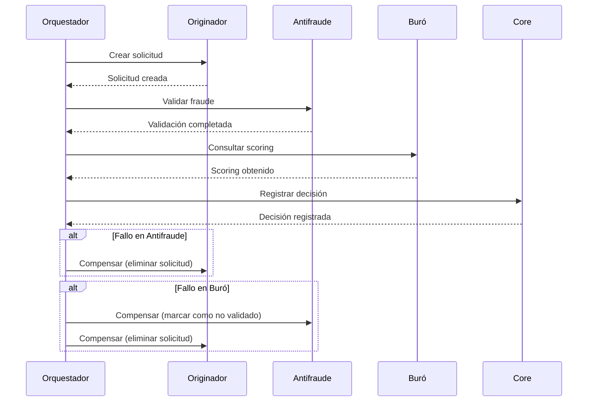

# Estrategias para Consistencia en Transacciones Distribuidas

## Introducción
En un sistema distribuido como el de gestión de préstamos hipotecarios, garantizar la consistencia de las transacciones es crítico. Este documento describe estrategias, herramientas y ejemplos para manejar transacciones distribuidas.

## Desafíos

1. **Atomicidad**: Garantizar que todas las operaciones de una transacción se completen o ninguna.
2. **Consistencia**: Asegurar que el sistema permanezca en un estado válido después de cada transacción.
3. **Aislamiento**: Evitar conflictos entre transacciones concurrentes.
4. **Durabilidad**: Asegurar que los cambios persistan después de un fallo.

## Estrategias

### 1. Patrón Saga
**Descripción**: Divide una transacción distribuida en una secuencia de transacciones locales, cada una con una operación compensatoria para revertir cambios.

**Tipos**:
- **Saga orquestada**: Un servicio central coordina las transacciones.
- **Saga coreografiada**: Cada servicio emite eventos para desencadenar la siguiente transacción.

**Ejemplo en el dominio**: Aprobación de un préstamo.



**Herramientas**:
- **Axon Framework**: Para implementar sagas orquestadas.
- **Eventuate Tram**: Para sagas coreografiadas con eventos.

### 2. Compensación
**Descripción**: Define operaciones inversas para revertir cambios en caso de fallo.

**Ejemplo**:
- **Transacción**: Debitar cuenta del cliente.
- **Compensación**: Acreditar el mismo monto.

**Implementación en el dominio**:

| Servicio          | Operación               | Compensación               |
|-------------------|-------------------------|----------------------------|
| Originador        | Crear solicitud         | Eliminar solicitud         |
| Antifraude        | Validar transacción     | Marcar como no validado    |
| Buró              | Consultar scoring       | (No requiere compensación) |
| Core              | Registrar decisión      | Revertir decisión          |

### 3. Two-Phase Commit (2PC)
**Descripción**: Un coordinador gestiona la preparación y confirmación de todas las partes.

**Limitaciones**:
- **Bloqueo**: Los recursos quedan bloqueados hasta que todas las partes confirman.
- **No escalable**: No recomendado para sistemas con alta latencia.

**Alternativa**: Usar 2PC solo para transacciones críticas (ej. transferencias interbancarias).

## Herramientas

### Axon Framework
- **Soporte para Sagas**: Permite definir sagas orquestadas con compensaciones.
- **Event Sourcing**: Persiste el estado como una secuencia de eventos.
- **CQRS**: Separa comandos (escritura) de consultas (lectura).

**Ejemplo de saga en Axon**:
```java
@Saga
public class LoanApprovalSaga {
    @Autowired
    private transient CommandGateway commandGateway;

    @StartSaga
    @SagaEventHandler(associationProperty = "loanId")
    public void handle(LoanRequestedEvent event) {
        commandGateway.send(new ValidateFraudCommand(event.getLoanId()));
    }

    @SagaEventHandler(associationProperty = "loanId")
    public void handle(FraudCheckCompletedEvent event) {
        if (!event.isFraudulent()) {
            commandGateway.send(new CheckRiskScoringCommand(event.getLoanId()));
        } else {
            commandGateway.send(new RejectLoanCommand(event.getLoanId()));
        }
    }

    @EndSaga
    @SagaEventHandler(associationProperty = "loanId")
    public void handle(LoanDecisionEvent event) {
        // Finalizar saga
    }
}
```

### Camunda
- **BPMN para Sagas**: Permite modelar flujos de compensación en BPMN.
- **Integración con Kafka**: Para eventos en sagas coreografiadas.

**Ejemplo de BPMN con compensación**:
```xml
<bpmn:serviceTask id="validateFraud" name="Validar Fraude"
    camunda:class="com.example.ValidateFraudDelegate">
    <bpmn:extensionElements>
        <camunda:failedJobRetryTimeCycle>R3/PT10S</camunda:failedJobRetryTimeCycle>
    </bpmn:extensionElements>
</bpmn:serviceTask>

<bpmn:boundaryEvent id="fraudValidationFailed" attachedToRef="validateFraud">
    <bpmn:compensateEventDefinition />
</bpmn:boundaryEvent>

<bpmn:serviceTask id="compensateFraud" name="Compensar Fraude"
    camunda:class="com.example.CompensateFraudDelegate" isForCompensation="true" />
```

## Ejemplos de Implementación

### 1. Saga Orquestada con Axon
**Flujo**: Originador → Antifraude → Buró → Core

**Pasos**:
1. El orquestador envía `ValidateFraudCommand`.
2. Si falla, envía `CompensateLoanCreationCommand`.
3. Si tiene éxito, envía `CheckRiskScoringCommand`.
4. Si falla, envía `CompensateFraudValidationCommand`.
5. Si tiene éxito, envía `RegisterLoanDecisionCommand`.

### 2. Saga Coreografiada con Eventuate Tram
**Flujo**:
1. Originador emite `LoanRequestedEvent`.
2. Antifraude consume el evento y emite `FraudCheckCompletedEvent`.
3. Si falla, emite `FraudCheckFailedEvent`.
4. Buró consume `FraudCheckCompletedEvent` y emite `RiskScoringCompletedEvent`.
5. Core consume `RiskScoringCompletedEvent` y emite `LoanDecisionEvent`.

## Estrategias de Mitigación de Fallos

| Modo de Fallo               | Impacto               | Mitigación                                                                 |
|------------------------------|-----------------------|----------------------------------------------------------------------------|
| Timeout en servicio         | Bloqueo de transacción | Retry con exponential backoff (Resilience4j)                              |
| Fallo en compensación       | Inconsistencia        | Loguear fallos y notificar a equipo de soporte                            |
| Eventos duplicados          | Datos duplicados      | Idempotencia en consumidores (ej. IDs únicos)                             |
| Orden incorrecto de eventos | Estado inválido       | Usar timestamps o versiones en eventos                                     |

## Conclusión

La elección de la estrategia depende de:
- **Complejidad del flujo**: Orquestación para flujos complejos con muchas decisiones.
- **Requisitos de consistencia**: Sagas para consistencia eventual, 2PC para atomicidad estricta.
- **Herramientas disponibles**: Axon Framework para Java, Camunda para BPMN.

**Recomendación**: Usar sagas orquestadas para el sistema de préstamos, con compensaciones para manejar fallos y eventos para notificaciones.