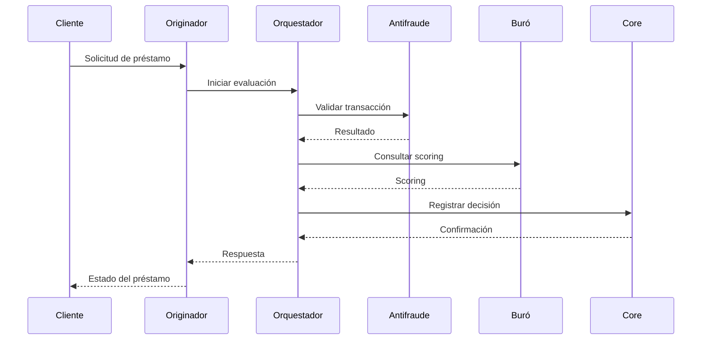
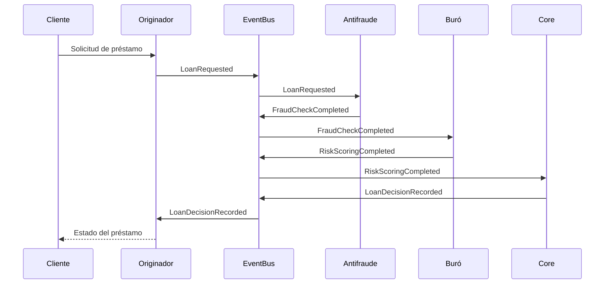

# Decisión de Arquitectura: Orquestación vs Coreografía

## Contexto
El sistema de gestión de préstamos hipotecarios integra múltiples servicios:
- **Originador de créditos**: Recibe solicitudes de préstamo y valida datos iniciales.
- **Motor antifraude**: Analiza transacciones para detectar actividades sospechosas.
- **Buró de riesgos**: Proporciona scoring de riesgo crediticio.
- **Core bancario**: Registra la aprobación/rechazo del préstamo y gestiona desembolsos.

La coordinación entre estos servicios puede implementarse mediante **orquestación** (un servicio centralizado gestiona el flujo) o **coreografía** (cada servicio emite eventos y reacciona a ellos).

## Análisis de Alternativas

### Orquestación
**Ventajas:**
- **Control centralizado**: Un servicio orquestador (ej. `LoanOrchestrator`) define y gestiona el flujo completo, simplificando la lógica de negocio.
- **Visibilidad**: Facilita el monitoreo y trazabilidad de las transacciones.
- **Manejo de errores**: Permite implementar compensaciones y rollbacks de manera coordinada.

**Desventajas:**
- **Acoplamiento**: El orquestador depende de la disponibilidad de todos los servicios.
- **Escalabilidad limitada**: El orquestador puede convertirse en un cuello de botella.
- **Complejidad**: Requiere mantener la lógica de flujo en un solo lugar.

**Ejemplo en el dominio:**

### Coreografía
**Ventajas:**
- **Desacoplamiento**: Cada servicio opera de manera independiente, emitiendo y reaccionando a eventos.
- **Escalabilidad**: Los servicios pueden escalar horizontalmente sin dependencias.
- **Flexibilidad**: Permite agregar nuevos servicios sin modificar el flujo central.

**Desventajas:**
- **Complejidad distribuida**: La lógica de negocio se distribuye entre servicios, dificultando el seguimiento.
- **Consistencia eventual**: Requiere mecanismos para manejar compensaciones y rollbacks.
- **Dificultad en el monitoreo**: La trazabilidad requiere herramientas adicionales (ej. correlación de IDs).

**Ejemplo en el dominio:**

## Decisión Final: Orquestación

**Justificación:**
1. **Complejidad del dominio**: El proceso de aprobación de préstamos requiere decisiones centralizadas (ej. rechazar si el scoring es bajo o hay fraude). La orquestación simplifica la implementación de estas reglas.
2. **Requisitos de consistencia**: El sistema debe garantizar que todas las validaciones se completen antes de registrar la decisión en el core bancario. La orquestación permite manejar transacciones distribuidas con patrones como **Saga**.
3. **Monitoreo y trazabilidad**: La orquestación proporciona una visión unificada del flujo, facilitando la auditoría y el diagnóstico de errores.

**Trade-offs aceptados:**
- **Acoplamiento**: Se mitiga utilizando contratos claros (OpenAPI) y patrones de resiliencia (retry, circuit breaker).
- **Escalabilidad**: El orquestador se diseña como un servicio stateless para permitir escalado horizontal.

## Implementación Propuesta
- **Herramientas**: Camunda para la orquestación del flujo, Kafka para eventos de compensación.
- **Patrones de resiliencia**: Retry con exponential backoff (Resilience4j), circuit breaker.
- **Consistencia**: Patrón Saga con compensación para manejar fallos parciales.

## Referencias
- [Camunda BPMN](https://camunda.com/)
- [Resilience4j](https://resilience4j.readme.io/)
- [Patrón Saga](https://microservices.io/patterns/data/saga.html)

---