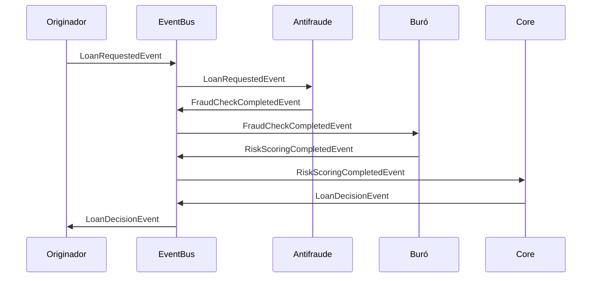

# Arquitectura Orientada a Eventos (EDA)

## Introducción
La arquitectura orientada a eventos (EDA) permite desacoplar los servicios del sistema de gestión de préstamos hipotecarios, facilitando la escalabilidad y la resiliencia. En este documento se describen los casos de uso, tecnologías y beneficios de la implementación.

## Casos de Uso

### 1. Notificación de Aprobación/Rechazo de Préstamo
- **Evento**: `LoanDecisionEvent`
- **Emisor**: Core bancario
- **Suscriptores**: Originador de créditos, Motor antifraude, Buró de riesgos
- **Contenido del evento**:
  ```yaml
  LoanDecisionEvent:
    type: object
    properties:
      loanId:
        type: string
        example: "LOAN-2023-001"
      status:
        type: string
        enum: [APPROVED, REJECTED]
        example: "APPROVED"
      reason:
        type: string
        example: "Scoring de riesgo aceptable"
      timestamp:
        type: string
        format: date-time
        example: "2023-10-01T12:00:00Z"
  ```

### 2. Actualización de Scoring de Riesgo
- **Evento**: `RiskScoringUpdatedEvent`
- **Emisor**: Buró de riesgos
- **Suscriptores**: Core bancario, Originador de créditos
- **Contenido del evento**:
  ```yaml
  RiskScoringUpdatedEvent:
    type: object
    properties:
      loanId:
        type: string
        example: "LOAN-2023-001"
      scoring:
        type: integer
        example: 720
      updatedAt:
        type: string
        format: date-time
        example: "2023-10-01T11:55:00Z"
  ```

### 3. Detección de Fraude
- **Evento**: `FraudDetectedEvent`
- **Emisor**: Motor antifraude
- **Suscriptores**: Core bancario, Originador de créditos
- **Contenido del evento**:
  ```yaml
  FraudDetectedEvent:
    type: object
    properties:
      loanId:
        type: string
        example: "LOAN-2023-001"
      fraudType:
        type: string
        example: "ID_DUPLICATE"
      confidence:
        type: number
        format: float
        example: 0.95
  ```

## Tecnologías Propuestas

### Broker de Eventos
- **Kafka**: Para eventos de alta frecuencia y persistencia.
  - **Tópicos**: `loan-decisions`, `risk-updates`, `fraud-alerts`.
  - **Particiones**: 3 para escalabilidad.
  - **Retención**: 7 días para eventos críticos.

- **AWS EventBridge**: Para eventos de negocio con integración a servicios AWS.
  - **Reglas**: Filtrado por tipo de evento (`LoanDecisionEvent`, `RiskScoringUpdatedEvent`).
  - **Destinos**: Lambda functions para procesamiento adicional.

### Frameworks de EDA
- **Spring Cloud Stream**: Para aplicaciones Java que consumen/producen eventos en Kafka.
- **Eventuate Tram**: Para implementar el patrón Saga con eventos.

## Beneficios de EDA

1. **Desacoplamiento**: Los servicios no dependen directamente unos de otros, facilitando cambios independientes.
2. **Escalabilidad**: Los eventos permiten procesamiento asíncrono y paralelo.
3. **Resiliencia**: Los brokers de eventos actúan como buffer ante fallos temporales.
4. **Extensibilidad**: Nuevos servicios pueden suscribirse a eventos existentes sin modificar el emisor.

## Ejemplo de Flujo con EDA



## Consideraciones de Implementación

- **Idempotencia**: Los consumidores de eventos deben manejar duplicados (ej. usando IDs únicos).
- **Orden de eventos**: Usar timestamps o versiones para garantizar el ordenamiento.
- **Seguridad**: Encriptar eventos sensibles (ej. datos personales) y validar firmas.
- **Monitoreo**: Implementar métricas para el throughput y latencia de eventos.

## Herramientas de Soporte
- **Schema Registry**: Para validar esquemas de eventos (ej. Avro, JSON Schema).
- **Kafka UI**: Para monitorear tópicos y particiones.
- **Prometheus + Grafana**: Para métricas de eventos.

---