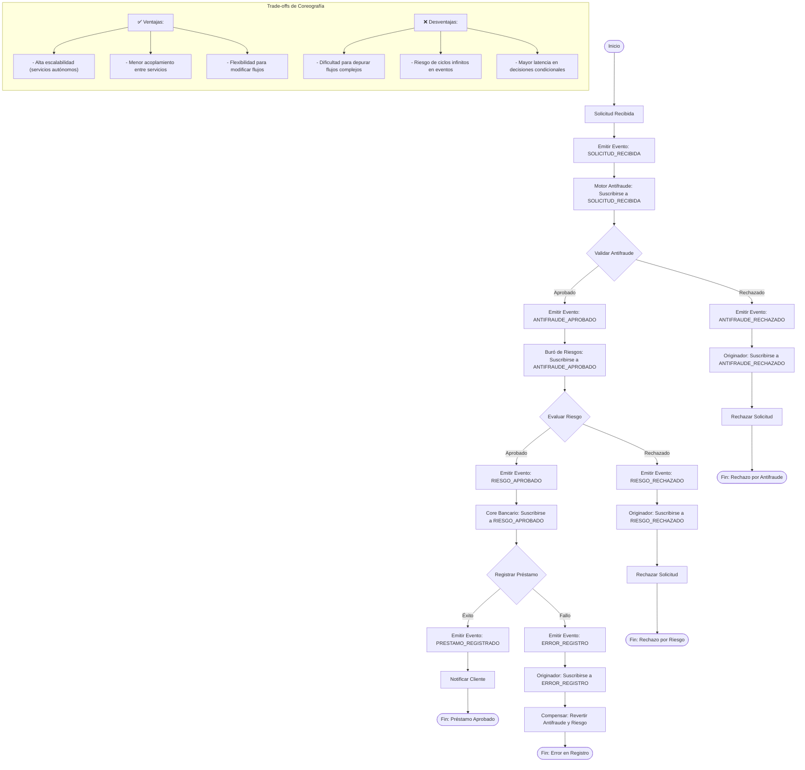

# Proceso de Coreografía para Gestión de Préstamos Hipotecarios

## Descripción del Flujo

### Actores
- **Originador de Créditos**: Servicio que emite el evento inicial y maneja compensaciones.
- **Motor Antifraude**: Servicio que suscribe a `SOLICITUD_RECIBIDA` y emite resultados.
- **Buró de Riesgos**: Servicio que suscribe a `ANTIFRAUDE_APROBADO` y emite resultados.
- **Core Bancario**: Servicio que suscribe a `RIESGO_APROBADO` y registra préstamos.
- **Bus de Eventos**: Medio de comunicación entre servicios (ej. Kafka, RabbitMQ).

### Eventos Clave
| Evento                     | Emisor               | Suscriptores                | Payload                                                                 |
|-----------------------------|----------------------|-----------------------------|--------------------------------------------------------------------------|
| `SOLICITUD_RECIBIDA`        | Originador           | Motor Antifraude            | `{ solicitudId, clienteId, monto, plazoMeses }`                          |
| `ANTIFRAUDE_APROBADO`       | Motor Antifraude     | Buró de Riesgos             | `{ solicitudId, resultado: "SIN_RIESGO", metodoValidacion }`           |
| `ANTIFRAUDE_RECHAZADO`      | Motor Antifraude     | Originador                  | `{ solicitudId, motivo: "IDENTIDAD_SOSPECHOSA" }`                      |
| `RIESGO_APROBADO`           | Buró de Riesgos      | Core Bancario               | `{ solicitudId, score: 750, aprobado: true }`                            |
| `RIESGO_RECHAZADO`          | Buró de Riesgos      | Originador                  | `{ solicitudId, motivo: "SCORE_INSUFICIENTE" }`                        |
| `PRESTAMO_REGISTRADO`       | Core Bancario        | Originador                  | `{ solicitudId, numeroPrestamo: "PR-2023-4567" }`                      |
| `ERROR_REGISTRO`            | Core Bancario        | Originador                  | `{ solicitudId, error: "FALLO_EN_BASE_DE_DATOS" }`                     |

### Mecanismo de Compensación
- **Patrón Saga Coreografiado**: Cada servicio emite eventos de compensación:
  - Antifraude: `ANTIFRAUDE_COMPENSADO` (ej. liberar recursos).
  - Riesgo: `RIESGO_COMPENSADO` (ej. actualizar score).
  - Core: `PRESTAMO_REVERTIDO` (ej. eliminar registro).

- **Originador**: Suscribe a eventos de error y emite compensaciones en cascada:
  1. Si recibe `ERROR_REGISTRO`, emite `REVERTIR_RIESGO`.
  2. El servicio de riesgo suscribe a `REVERTIR_RIESGO` y emite `RIESGO_COMPENSADO`.
  3. El originador suscribe a `RIESGO_COMPENSADO` y emite `REVERTIR_ANTIFRAUDE`.

### Puntos de Decisión
1. **Validación Antifraude**
   - **Regla**: `resultado = 'SIN_RIESGO'`
   - **Acción**: Emite `ANTIFRAUDE_APROBADO` si se cumple, `ANTIFRAUDE_RECHAZADO` si no.

2. **Evaluación de Riesgo**
   - **Regla**: `score >= 700`
   - **Acción**: Emite `RIESGO_APROBADO` si se cumple, `RIESGO_RECHAZADO` si no.

3. **Registro en Core Bancario**
   - **Regla**: Validación interna del core.
   - **Acción**: Emite `PRESTAMO_REGISTRADO` si tiene éxito, `ERROR_REGISTRO` si falla.

### Trade-offs vs Orquestación
- **Coreografía** es ideal para este caso si:
  1. **Escalabilidad**: Se espera alto volumen de solicitudes (ej. >1000 solicitudes/hora).
  2. **Autonomía**: Cada servicio puede evolucionar independientemente.
  3. **Tolerancia a Fallos**: Los servicios pueden fallar sin bloquear el flujo completo.

- **Desafíos**:
  - **Depuración**: Seguir el flujo requiere correlacionar eventos (necesita trazabilidad con `solicitudId`).
  - **Consistencia Eventual**: Los estados temporales pueden ser inconsistentes.
  - **Latencia**: Las decisiones condicionales (ej. validar antifraude antes de riesgo) requieren orquestación de eventos.

### Herramientas Recomendadas
- **Bus de Eventos**: Apache Kafka, AWS EventBridge o Azure Event Grid.
- **Trazabilidad**: OpenTelemetry + Jaeger para correlacionar eventos.
- **Resiliencia**: Patrones como Circuit Breaker (Resilience4j) y Retry (Spring Retry).