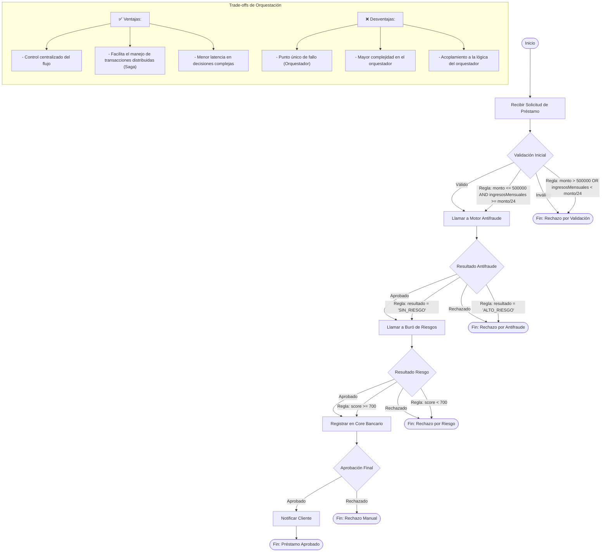

# Proceso de Orquestación para Gestión de Préstamos Hipotecarios

## Descripción del Flujo

### Actores
- **Originador de Créditos**: Servicio que recibe la solicitud inicial del cliente y coordina el proceso.
- **Motor Antifraude**: Servicio externo que valida la identidad y comportamiento del solicitante.
- **Buró de Riesgos**: Servicio externo que evalúa el score crediticio y capacidad de pago.
- **Core Bancario**: Sistema interno que registra préstamos aprobados.

### Puntos de Decisión
1. **Validación Inicial**
   - **Regla**: `monto <= 500000 AND ingresosMensuales >= monto/24`
   - **Acción**: Si se cumple, pasa a antifraude. Si no, rechaza la solicitud.

2. **Resultado Antifraude**
   - **Regla**: `resultado = 'SIN_RIESGO'`
   - **Acción**: Si se aprueba, pasa a riesgo. Si no, rechaza la solicitud.

3. **Resultado Riesgo**
   - **Regla**: `score >= 700`
   - **Acción**: Si el score es suficiente, registra en core bancario. Si no, rechaza.

4. **Aprobación Final**
   - **Regla**: Revisión manual por analista.
   - **Acción**: Aprobación o rechazo basado en criterios adicionales.

### Mecanismo de Transacciones Distribuidas (Saga)
- **Compensación**: Si alguna validación falla, el orquestador invoca acciones compensatorias:
  - Antifraude falla → Marcar solicitud como rechazada.
  - Riesgo falla → Liberar recursos reservados en antifraude.
  - Core falla → Revertir aprobaciones en antifraude y riesgo.

### Extensiones EDA
- **Eventos Emitidos**:
  - `SOLICITUD_RECIBIDA` (al iniciar).
  - `ANTIFRAUDE_COMPLETADO` (tras validación antifraude).
  - `RIESGO_EVALUADO` (tras evaluación de riesgo).
  - `PRESTAMO_REGISTRADO` (tras registro en core).

- **Suscripciones**:
  - El orquestador suscribe a eventos de fallo para ejecutar compensaciones.

### Trade-offs vs Coreografía
- **Orquestación** es ideal para este caso porque:
  1. **Complejidad del Flujo**: El proceso requiere decisiones condicionales complejas (ej. validar antifraude antes de riesgo).
  2. **Transacciones Distribuidas**: La Saga necesita un coordinador central para manejar compensaciones.
  3. **Visibilidad**: El orquestador actúa como punto único de monitoreo para el estado global del proceso.

- **Alternativa Coreografiada**: Sería más adecuada si:
  - Los servicios fueran más autónomos.
  - No hubiera necesidad de compensaciones complejas.
  - La latencia de eventos fuera crítica.