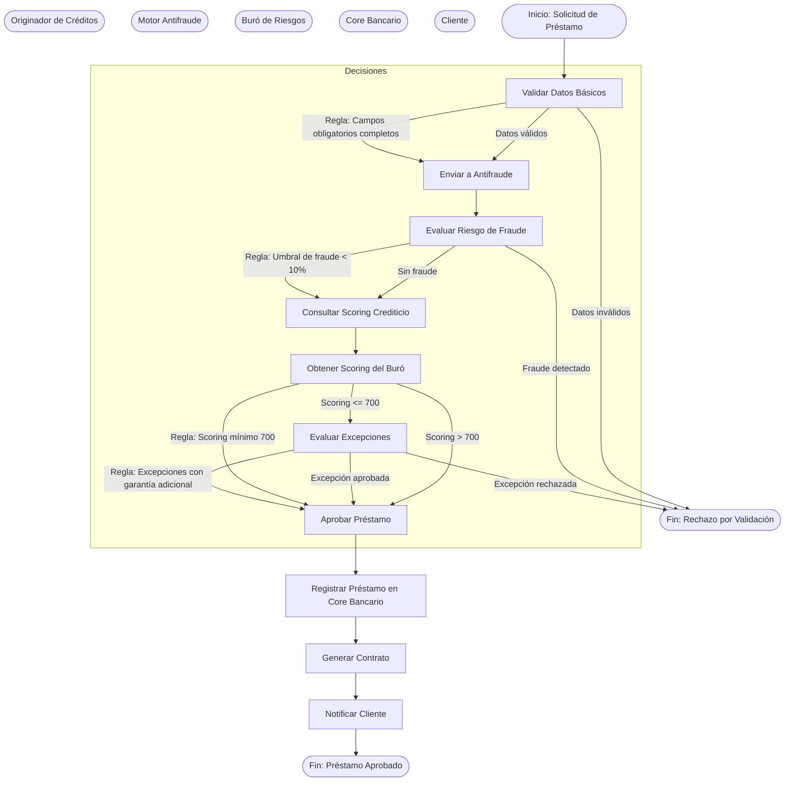

# Proceso de Gestión de Préstamos Hipotecarios (BPMN 2.0)

## Descripción General
Este documento describe el flujo de negocio para la gestión de préstamos hipotecarios utilizando notación BPMN 2.0. El proceso integra los siguientes actores:
- **Originador de Créditos**: Servicio encargado de recibir y validar la solicitud inicial del cliente.
- **Motor Antifraude**: Servicio que evalúa el riesgo de fraude en la solicitud.
- **Buró de Riesgos**: Servicio externo que proporciona el scoring crediticio del solicitante.
- **Core Bancario**: Sistema central que registra y gestiona el préstamo aprobado.

El flujo incluye decisiones basadas en reglas de negocio explícitas, como la aprobación/rechazo del préstamo según el scoring de riesgo.

## Diagrama BPMN


## Actores y Responsabilidades
| Actor                  | Responsabilidad                                                                                     |
|------------------------|-----------------------------------------------------------------------------------------------------|
| Originador de Créditos | Validar datos básicos de la solicitud (ej. ingresos, propiedades, identificación).                |
| Motor Antifraude      | Evaluar el riesgo de fraude en la solicitud (ej. documentos falsificados, patrones sospechosos). |
| Buró de Riesgos        | Proporcionar el scoring crediticio del solicitante basado en historial financiero.                 |
| Core Bancario          | Registrar el préstamo aprobado, generar contrato y notificar al cliente.                          |

## Puntos de Decisión y Reglas de Negocio
1. **Validación de Datos Básicos**
   - **Regla**: Todos los campos obligatorios deben estar completos y en formato válido.
   - **Campos obligatorios**: `id_solicitud`, `id_cliente`, `monto_solicitado`, `plazo_meses`, `ingresos_mensuales`, `valor_propiedad`.
   - **Ejemplo**: Si `monto_solicitado` > `valor_propiedad * 0.8`, rechazar solicitud.

2. **Evaluación de Fraude**
   - **Regla**: Si el riesgo de fraude supera el 10%, rechazar la solicitud.
   - **Métricas**: Documentos inconsistentes, patrones de comportamiento sospechosos.

3. **Scoring Crediticio**
   - **Regla**: Scoring mínimo de 700 para aprobación automática.
   - **Fuente**: Buró de riesgos (ej. Equifax, TransUnion).

4. **Excepciones**
   - **Regla**: Si el scoring está entre 600 y 700, evaluar excepciones con garantía adicional.
   - **Garantía**: Aval bancario o propiedad adicional.

## Mensajes entre Servicios
| Mensaje                     | Origen               | Destino              | Contenido                                                                                     |
|-----------------------------|----------------------|----------------------|---------------------------------------------------------------------------------------------|
| `validar_solicitud`         | Originador           | Motor Antifraude     | `id_solicitud`, `id_cliente`, `documentos`                                                  |
| `resultado_antifraude`      | Motor Antifraude     | Originador           | `id_solicitud`, `riesgo_fraude` (0-100), `aprobado` (true/false)                           |
| `consultar_scoring`         | Originador           | Buró de Riesgos      | `id_cliente`, `tipo_consulta` ("hipotecario")                                              |
| `resultado_scoring`         | Buró de Riesgos      | Originador           | `id_cliente`, `scoring` (300-850), `detalle_riesgo`                                         |
| `registrar_prestamo`        | Originador           | Core Bancario        | `id_solicitud`, `monto_aprobado`, `plazo_meses`, `tasa_interes`, `id_cliente`               |
| `confirmacion_registro`     | Core Bancario        | Originador           | `id_prestamo`, `fecha_aprobacion`, `estado` ("APROBADO"|"RECHAZADO")                    |

## Ejemplo de Datos
- **Solicitud Válida**:
  ```json
  {
    "id_solicitud": "SOL-2023-001",
    "id_cliente": "CLI-45678",
    "monto_solicitado": 250000,
    "plazo_meses": 360,
    "ingresos_mensuales": 8000,
    "valor_propiedad": 300000
  }
  ```

- **Resultado Antifraude**:
  ```json
  {
    "id_solicitud": "SOL-2023-001",
    "riesgo_fraude": 5,
    "aprobado": true
  }
  ```

- **Resultado Scoring**:
  ```json
  {
    "id_cliente": "CLI-45678",
    "scoring": 720,
    "detalle_riesgo": "Riesgo bajo"
  }
  ```

## Consideraciones Técnicas
- **Tiempo de Espera**: Los servicios externos (Buró de Riesgos, Motor Antifraude) tienen un timeout de 5 segundos.
- **Idempotencia**: Las consultas al Buró de Riesgos deben ser idempotentes para evitar cargos duplicados.
- **Transaccionalidad**: La aprobación del préstamo debe ser atómica (registro en Core Bancario + notificación al cliente).
- **Eventos**: Los eventos relevantes (ej. `prestamo_aprobado`, `prestamo_rechazado`) deben emitirse para otros servicios.

## Validación del Proceso
Para validar este flujo:
1. Ejecutar el comando:
   ```bash
   npx @redocly/cli lint contratos/openapi.yaml
   ```
2. Verificar que los esquemas de los mensajes (`validar_solicitud`, `resultado_antifraude`, etc.) coincidan con los definidos en el OpenAPI.
3. Asegurar que las reglas de negocio (ej. scoring mínimo) estén documentadas en `criterios-de-aceptacion.feature`.

---